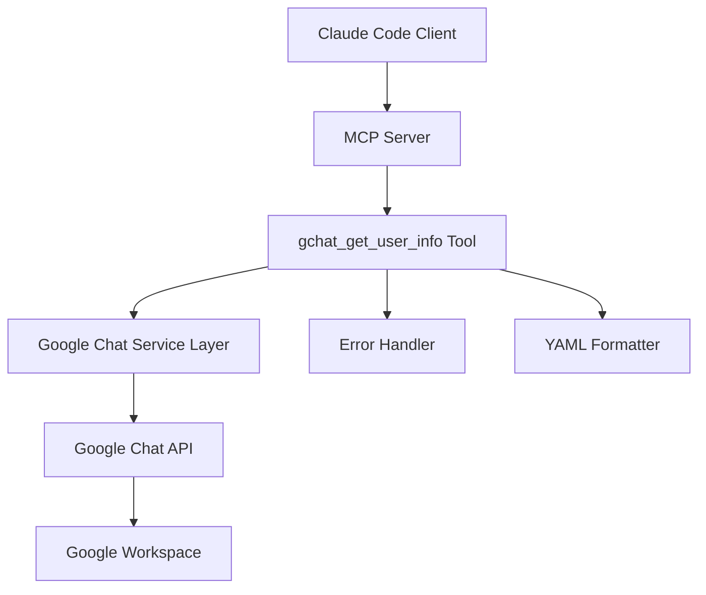
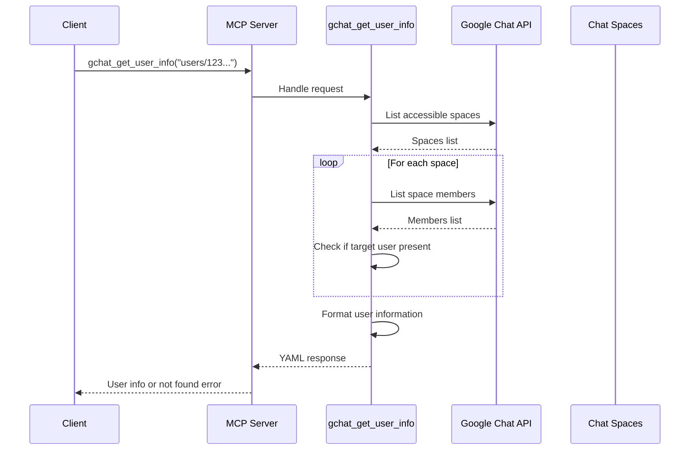

# Technical Design

## Overview

This feature implements a simple Google Chat user information retrieval tool that allows users to get username and display name from a Google Chat user ID. The solution leverages existing Google Chat API integrations and follows established project patterns to provide a straightforward MCP tool for user information lookup.

## Requirements Mapping

### Design Component Traceability
- **MCP Tool Implementation** → R1.1: Simple user information retrieval interface
- **Google Chat API Integration** → R1.2: Utilize existing authentication and service layer
- **User Search Logic** → R1.3: Find user across accessible spaces
- **Error Handling** → R1.4: Robust error responses for user not found scenarios

### User Story Coverage
- **Primary User Story**: As a user, I want to get username and display name from a Google Chat user ID (like `users/101192027393824256975`) through a simple interface
- **Technical Approach**: Single MCP tool that searches across accessible Google Chat spaces to locate and return user information

## Architecture



### Technology Stack
Based on existing project architecture:

- **Backend**: Go 1.23.2 with MCP protocol implementation
- **Google API Client**: `google.golang.org/api/chat/v1` 
- **Authentication**: OAuth 2.0 with comprehensive Google Chat scopes
- **Output Format**: YAML via `gopkg.in/yaml.v3`
- **Error Handling**: `util.ErrorGuard` wrapper pattern

### Architecture Decision Rationale

- **Why Space-based Search**: Google Chat API lacks direct user lookup endpoints; user information is accessible through space memberships
- **Why Existing Service Layer**: Leverages established OAuth authentication and HTTP client configuration
- **Why YAML Output**: Maintains consistency with other Google Chat tools in the project
- **Why Single Tool**: Keeps implementation simple as requested by user requirements

### Data Flow



## Components and Interfaces

### MCP Tool Definition

```go
// New tool in tools/gchat.go
getUserInfoTool := mcp.NewTool("gchat_get_user_info",
    mcp.WithDescription("Get username and display name for a Google Chat user by user ID"),
    mcp.WithString("user_id", mcp.Required(), mcp.Description("Google Chat user ID in format 'users/123456789'")),
)
```

### Backend Service Method

```go
func gChatGetUserInfoHandler(arguments map[string]interface{}) (*mcp.CallToolResult, error) {
    userID := arguments["user_id"].(string)
    
    // Validate user ID format
    if !strings.HasPrefix(userID, "users/") {
        return mcp.NewToolResultError("Invalid user ID format. Must start with 'users/'"), nil
    }
    
    // Search for user across accessible spaces
    userInfo, found, err := findUserInSpaces(userID)
    if err != nil {
        return mcp.NewToolResultError(fmt.Sprintf("Error searching for user: %v", err)), nil
    }
    
    if !found {
        return mcp.NewToolResultError("User not found in accessible spaces"), nil
    }
    
    // Format and return user information
    yamlResult, err := yaml.Marshal(userInfo)
    if err != nil {
        return mcp.NewToolResultError(fmt.Sprintf("Failed to format user info: %v", err)), nil
    }
    
    return mcp.NewToolResultText(string(yamlResult)), nil
}
```

### API Integration

No new API endpoints - utilizes existing Google Chat API through established service layer:
- `services.DefaultGChatService().Spaces.List()` - Get accessible spaces
- `services.DefaultGChatService().Spaces.Members.List(spaceName)` - Get space members

## Data Models

### Input Model
```go
type GetUserInfoRequest struct {
    UserID string `json:"user_id"` // Format: "users/123456789"
}
```

### Output Model
```go
type UserInfoResponse struct {
    Name        string   `yaml:"name"`        // Full resource name
    DisplayName string   `yaml:"displayName"` // User's display name  
    Type        string   `yaml:"type"`        // USER, BOT, etc.
    Found       bool     `yaml:"found"`       // Whether user was located
    FoundInSpaces []string `yaml:"foundInSpaces,omitempty"` // Spaces where user was found
}
```

### Error Response Model
```go
type ErrorResponse struct {
    Error   string `yaml:"error"`
    Details string `yaml:"details,omitempty"`
}
```

## Error Handling

Following existing project patterns:

### Error Scenarios
1. **Invalid User ID Format**: Return descriptive error for malformed user IDs
2. **User Not Found**: Clear message when user isn't in accessible spaces  
3. **API Errors**: Handle Google Chat API failures gracefully
4. **Authentication Errors**: Leverage existing OAuth error handling

### Error Response Strategy
```go
// Example error responses
return mcp.NewToolResultError("Invalid user ID format. Must start with 'users/'"), nil
return mcp.NewToolResultError("User not found in accessible spaces"), nil  
return mcp.NewToolResultError(fmt.Sprintf("Google Chat API error: %v", err)), nil
```

## Security Considerations

- **OAuth 2.0 Authentication**: Uses existing secure Google Chat authentication
- **Scope Limitation**: Operates within pre-configured Google Chat API scopes
- **Input Validation**: Validates user ID format before API calls
- **No Data Storage**: Tool doesn't persist user information
- **Error Information Disclosure**: Error messages don't expose sensitive system details

## Performance & Scalability

### Performance Targets
| Metric | Target | Measurement |
|--------|--------|-------------|
| Response Time (typical) | < 2s | Single user lookup |
| Response Time (worst case) | < 10s | User in many spaces |
| API Calls | Minimized | Stop search on first match |

### Optimization Strategy
- **Early Exit**: Stop searching once user is found in first space
- **Concurrent Search**: Could parallelize space searches (future enhancement)
- **Caching**: No caching implemented (aligns with simple approach)

## Testing Strategy

### Risk Matrix
| Area | Risk | Must | Optional | Ref |
|---|---|---|---|---|
| Google Chat API | M | Unit, Integration | Resilience | API failures |
| User ID Validation | L | Unit | Property | Input validation |
| Error Handling | M | Unit | Integration | Error scenarios |

### Test Coverage
- **Unit Tests**: Input validation, error handling logic
- **Integration Tests**: Google Chat API interaction
- **End-to-End**: Full MCP tool workflow

### CI Gates
| Stage | Run | Gate | SLA |
|---|---|---|---|
| PR | Unit + Validation | Fail = block | ≤2m |
| Integration | API connectivity | Warn = review | ≤5m |

## Implementation Details

### File Modifications
- **tools/gchat.go**: Add new tool registration and handler
- **No new files required**: Leverages existing service layer

### Integration Points
- Uses existing `services.DefaultGChatService()`
- Follows established `util.ErrorGuard` error handling
- Maintains YAML output format consistency

### Deployment Considerations
- No additional configuration required
- Uses existing Google Chat API scopes
- No database or persistence layer needed