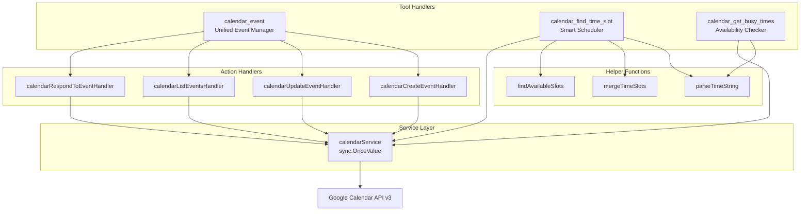
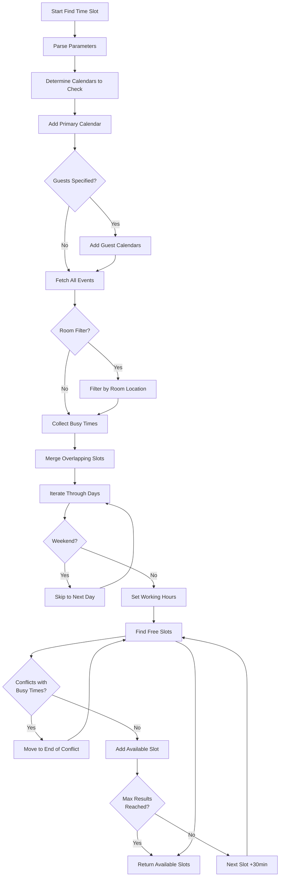
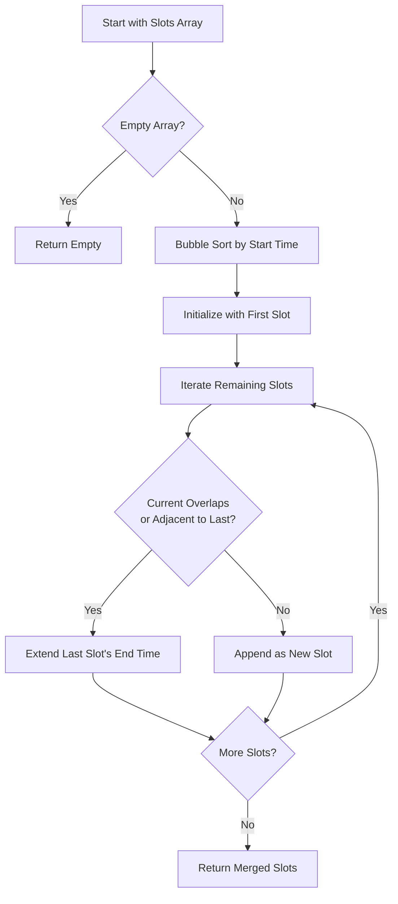
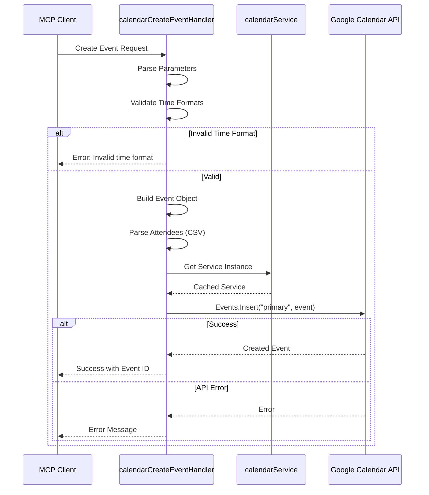
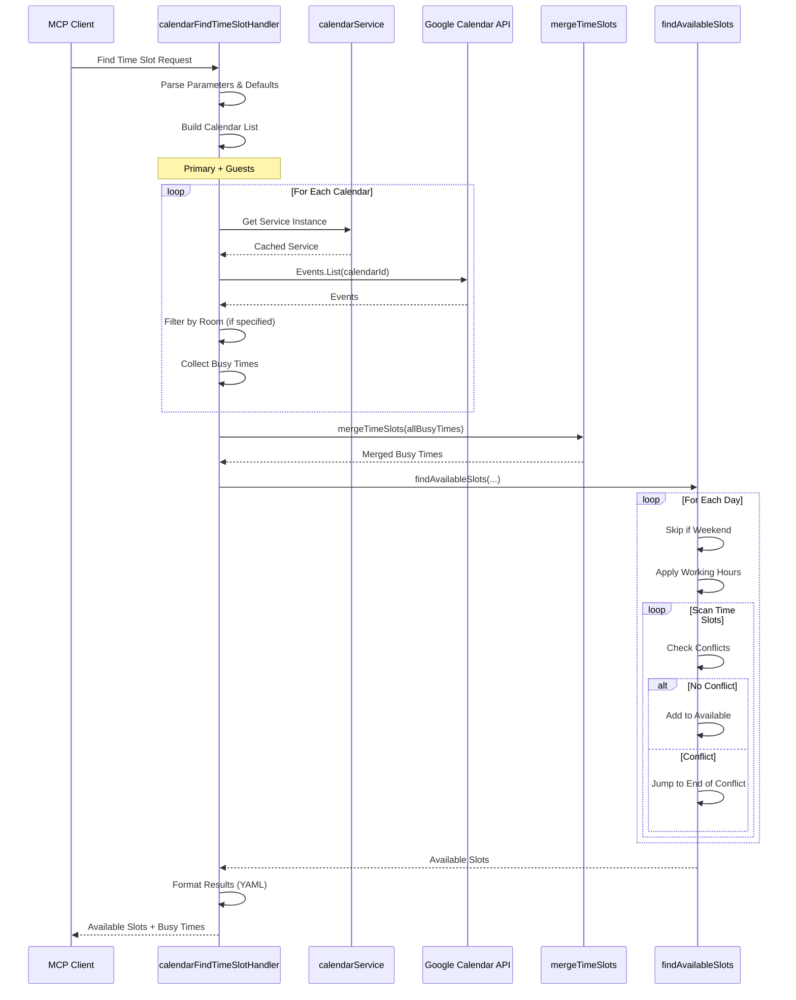

# Calendar Tools Module

## Overview

The Calendar module provides comprehensive Google Calendar integration for the MCP server, enabling event management, scheduling, and availability checking. With 664 lines of code, it implements 11 tools organized into a unified event management interface and specialized availability checking features.

## Module Metrics

| Metric | Value |
|--------|-------|
| **Lines of Code** | 664 |
| **Number of Tools** | 3 (11 sub-actions) |
| **Service Dependency** | `calendar.Service` |
| **Key Hub Components** | `parseTimeString` (PageRank: 0.0247) |
| **Complexity** | Medium-High (scheduling algorithms) |

## Architecture

### Component Diagram



### Data Structures

#### timeSlot
```go
type timeSlot struct {
    Start time.Time
    End   time.Time
}
```
Represents a time interval for availability calculations.

#### busyTime
```go
type busyTime struct {
    Start       time.Time
    End         time.Time
    Summary     string
    Organizer   string
    CalendarId  string
}
```
Represents a busy period with event details and ownership information.

## Tools

### 1. calendar_event

**Description**: Unified tool for managing Google Calendar events with multiple actions.

#### Actions

##### create
Create a new calendar event with attendees.

**Parameters**:
| Parameter | Type | Required | Description |
|-----------|------|----------|-------------|
| `action` | string | Yes | Must be "create" |
| `summary` | string | Yes | Event title |
| `description` | string | No | Event description |
| `start_time` | string | Yes | Start time (RFC3339) |
| `end_time` | string | Yes | End time (RFC3339) |
| `attendees` | string | No | Comma-separated email addresses |

**Example**:
```json
{
  "action": "create",
  "summary": "Team Meeting",
  "description": "Quarterly planning session",
  "start_time": "2024-03-15T14:00:00Z",
  "end_time": "2024-03-15T15:00:00Z",
  "attendees": "alice@example.com,bob@example.com"
}
```

**Response**:
```
Successfully created event with ID: abc123xyz
```

##### update
Update an existing event's details.

**Parameters**:
| Parameter | Type | Required | Description |
|-----------|------|----------|-------------|
| `action` | string | Yes | Must be "update" |
| `event_id` | string | Yes | ID of event to update |
| `summary` | string | No | New event title |
| `description` | string | No | New description |
| `start_time` | string | No | New start time (RFC3339) |
| `end_time` | string | No | New end time (RFC3339) |
| `attendees` | string | No | New attendee list (replaces existing) |

**Implementation Details**:
- Fetches existing event first
- Updates only provided fields
- Preserves unmodified fields

##### list
List events within a time range.

**Parameters**:
| Parameter | Type | Required | Description |
|-----------|------|----------|-------------|
| `action` | string | Yes | Must be "list" |
| `time_min` | string | No | Start time (default: now) |
| `time_max` | string | No | End time (default: 1 week from now) |
| `max_results` | number | No | Maximum events to return (default: 10) |

**Response Format** (YAML):
```yaml
count: 3
events:
  - id: "event1"
    summary: "Team Meeting"
    start: "2024-03-15 14:00"
    end: "2024-03-15 15:00"
    description: "Quarterly planning"
  - id: "event2"
    summary: "Code Review"
    start: "2024-03-16 10:00"
    end: "2024-03-16 11:00"
```

**Implementation Details**:
- Filters deleted events (`ShowDeleted(false)`)
- Expands recurring events (`SingleEvents(true)`)
- Orders by start time
- Returns formatted human-readable timestamps

##### respond
Respond to an event invitation.

**Parameters**:
| Parameter | Type | Required | Description |
|-----------|------|----------|-------------|
| `action` | string | Yes | Must be "respond" |
| `event_id` | string | Yes | ID of event to respond to |
| `response` | string | Yes | "accepted", "declined", or "tentative" |

**Implementation Details**:
- Finds attendee marked as "Self"
- Updates only user's response status
- Preserves other attendees' responses

### 2. calendar_find_time_slot

**Description**: Intelligent time slot finder that checks availability across multiple calendars, respects working hours, and can filter by room location.

**Parameters**:
| Parameter | Type | Required | Description |
|-----------|------|----------|-------------|
| `guests` | string | No | Comma-separated guest emails |
| `room` | string | No | Room name filter |
| `start_date` | string | Yes | Search start (RFC3339) |
| `end_date` | string | Yes | Search end (RFC3339) |
| `duration_minutes` | number | Yes | Meeting duration |
| `working_hours_start` | string | No | Start of work day (default: "09:00") |
| `working_hours_end` | string | No | End of work day (default: "17:00") |
| `max_results` | number | No | Maximum slots to return (default: 5) |

**Algorithm Flow**:



**Response Format** (YAML):
```yaml
available_slots:
  - start: "2024-03-15 14:00"
    end: "2024-03-15 15:00"
    day: "Friday"
  - start: "2024-03-15 15:30"
    end: "2024-03-15 16:30"
    day: "Friday"
duration_minutes: 60
guests_checked: "alice@example.com,bob@example.com"
room_filter: "Conference Room A"
busy_times:
  - start: "2024-03-15 10:00"
    end: "2024-03-15 11:00"
    summary: "Existing Meeting"
    organizer: "charlie@example.com"
    calendar: "alice@example.com"
```

**Key Features**:

1. **Multi-Calendar Checking**: Checks primary calendar and all guest calendars
2. **Room Filtering**: Filters events by room location (case-insensitive substring match)
3. **Busy Time Merging**: Merges overlapping events across all calendars
4. **Working Hours**: Respects configurable work day boundaries
5. **Weekend Skipping**: Automatically skips Saturdays and Sundays
6. **Conflict Detection**: Ensures proposed slots don't overlap with existing events
7. **Incremental Search**: Searches in 30-minute increments
8. **Detailed Results**: Returns both available slots and conflicting busy times

**Complexity**: High (PageRank: 0.024 for helper `parseTimeString`)
- Cyclomatic complexity from nested loops and conditionals
- Time slot merging algorithm
- Conflict detection logic

### 3. calendar_get_busy_times

**Description**: Retrieve busy time periods for one or multiple users within a date range.

**Parameters**:
| Parameter | Type | Required | Description |
|-----------|------|----------|-------------|
| `users` | string | No | Comma-separated user emails (default: primary calendar) |
| `start_date` | string | Yes | Period start (RFC3339) |
| `end_date` | string | Yes | Period end (RFC3339) |

**Response Format** (YAML):
```yaml
period:
  start: "2024-03-15 00:00"
  end: "2024-03-22 00:00"
calendars_checked:
  - "primary"
  - "alice@example.com"
total_busy_times: 12
busy_times:
  - start: "2024-03-15 10:00"
    end: "2024-03-15 11:00"
    calendar: "primary"
    summary: "Team Standup"
    organizer: "manager@example.com"
    day: "Friday"
    duration_minutes: 60
  - start: "2024-03-15 14:00"
    end: "2024-03-15 15:30"
    calendar: "alice@example.com"
    summary: "Client Call"
    organizer: "Alice Smith"
    day: "Friday"
    duration_minutes: 90
```

**Implementation Details**:
- Fetches events from all specified calendars
- Handles calendar access errors gracefully (includes error in results)
- Sorts busy times chronologically
- Calculates duration for each busy period
- Uses organizer's display name when available, falls back to email
- Includes day of week for easier reading

**Error Handling**:
- Inaccessible calendars: Continues processing other calendars and includes error message
- Invalid date format: Returns error immediately
- No events: Returns empty `busy_times` array

## Helper Functions

### parseTimeString

**Signature**: `func parseTimeString(timeStr string) (hour, minute int)`

**Purpose**: Parse time strings in "HH:MM" format for working hours configuration.

**Metrics**:
- **PageRank**: 0.0247 (High - hub component)
- **Complexity Score**: 20.16
- **Called By**: `calendarFindTimeSlotHandler`

**Implementation**:
```go
func parseTimeString(timeStr string) (hour, minute int) {
    parts := strings.Split(timeStr, ":")
    if len(parts) != 2 {
        return 9, 0 // Default to 9:00
    }

    if _, err := fmt.Sscanf(parts[0], "%d", &hour); err != nil {
        hour = 9 // Default hour
    }
    if _, err := fmt.Sscanf(parts[1], "%d", &minute); err != nil {
        minute = 0 // Default minute
    }
    return hour, minute
}
```

**Edge Cases**:
- Invalid format → defaults to 9:00
- Invalid hour → defaults hour to 9
- Invalid minute → defaults minute to 0

### mergeTimeSlots

**Signature**: `func mergeTimeSlots(slots []timeSlot) []timeSlot`

**Purpose**: Merge overlapping or adjacent time slots to simplify availability checking.

**Algorithm**:



**Time Complexity**: O(n²) due to bubble sort
**Space Complexity**: O(n) for merged array

**Example**:
```
Input:  [{09:00-10:00}, {09:30-11:00}, {14:00-15:00}]
Output: [{09:00-11:00}, {14:00-15:00}]
```

### findAvailableSlots

**Signature**: `func findAvailableSlots(startDate, endDate time.Time, busySlots []timeSlot, duration time.Duration, workStart, workEnd string, maxResults int) []timeSlot`

**Purpose**: Find available time slots within working hours that don't conflict with busy times.

**Algorithm**:

1. **Parse Working Hours**: Convert "HH:MM" strings to hour/minute integers
2. **Iterate Through Days**: From startDate to endDate
3. **Skip Weekends**: Exclude Saturday and Sunday
4. **Set Day Boundaries**: Apply working hours to current day
5. **Respect Search Bounds**: Clamp to startDate/endDate
6. **Scan for Availability**:
   - Start at beginning of work day
   - Check if slot fits before end of work day
   - For each potential slot:
     - Check conflicts with all busy times
     - If conflict: jump to end of conflicting busy time
     - If available: add to results and advance 30 minutes
7. **Return When Full**: Stop when maxResults reached

**Key Features**:
- 30-minute granularity for slot searching
- Intelligent conflict resolution (jumps to end of busy time)
- Working hours enforcement per day
- Weekend exclusion
- Early termination when max results reached

## Service Initialization

### calendarService

**Pattern**: `sync.OnceValue` for thread-safe lazy initialization

```go
var calendarService = sync.OnceValue(func() *calendar.Service {
    ctx := context.Background()

    tokenFile := os.Getenv("GOOGLE_TOKEN_FILE")
    if tokenFile == "" {
        panic("GOOGLE_TOKEN_FILE environment variable must be set")
    }

    credentialsFile := os.Getenv("GOOGLE_CREDENTIALS_FILE")
    if credentialsFile == "" {
        panic("GOOGLE_CREDENTIALS_FILE environment variable must be set")
    }

    client := services.GoogleHttpClient(tokenFile, credentialsFile)

    srv, err := calendar.NewService(ctx, option.WithHTTPClient(client))
    if err != nil {
        panic(fmt.Sprintf("failed to create Calendar service: %v", err))
    }

    return srv
})
```

**Lifecycle**:
1. **First Call**: Reads credentials, creates service, caches result
2. **Subsequent Calls**: Returns cached service (no I/O)
3. **Thread Safety**: `sync.OnceValue` ensures single initialization across concurrent requests

**Error Handling**:
- Missing environment variables → panic (fail-fast at initialization)
- Service creation failure → panic with descriptive message
- Runtime API errors → propagated to handlers as errors

## Data Flow

### Event Creation Flow



### Time Slot Finding Flow



## Error Handling

### Error Categories

| Error Type | Handler Behavior | Example |
|------------|-----------------|---------|
| **Invalid Parameters** | Return MCP error immediately | Invalid RFC3339 time format |
| **API Errors** | Wrap and return as MCP error | Event not found, permission denied |
| **Calendar Access Errors** | Continue processing others | Guest calendar inaccessible |
| **Service Initialization** | Panic (fail-fast) | Missing credentials |

### Error Messages

All errors are wrapped with context:
```go
return mcp.NewToolResultError(fmt.Sprintf("failed to create event: %v", err)), nil
```

ErrorGuard wrapper ensures:
- Panics are recovered with stack traces
- Errors are consistently formatted
- Client receives actionable error messages

## Performance Considerations

### Optimization Strategies

1. **Service Caching**: `sync.OnceValue` prevents repeated service initialization
2. **Single Events Expansion**: `SingleEvents(true)` simplifies recurring event handling
3. **Early Termination**: Stop searching when `maxResults` reached
4. **Conflict Jump**: When conflict found, jump to end of busy time (don't scan every minute)
5. **Incremental Scanning**: 30-minute increments balance granularity with performance

### Complexity Analysis

| Operation | Time Complexity | Notes |
|-----------|----------------|-------|
| **Create Event** | O(1) | Single API call |
| **List Events** | O(n) | n = number of events in range |
| **Update Event** | O(1) | Get + Update = 2 API calls |
| **Find Time Slots** | O(d × s × b) | d=days, s=slots per day, b=busy times |
| **Merge Time Slots** | O(n²) | Bubble sort + merge |
| **Get Busy Times** | O(c × n) | c=calendars, n=events per calendar |

**Bottlenecks**:
- `mergeTimeSlots`: O(n²) bubble sort (could optimize with `sort.Slice`)
- `findAvailableSlots`: Nested loops over days × slots × busy times

## Usage Examples

### Example 1: Create Event with Attendees

```json
{
  "action": "create",
  "summary": "Sprint Planning",
  "description": "Plan Q2 2024 sprint",
  "start_time": "2024-04-01T09:00:00-07:00",
  "end_time": "2024-04-01T10:30:00-07:00",
  "attendees": "dev1@company.com,dev2@company.com,pm@company.com"
}
```

### Example 2: Find Team Meeting Time

```json
{
  "guests": "alice@company.com,bob@company.com,charlie@company.com",
  "start_date": "2024-04-01T00:00:00Z",
  "end_date": "2024-04-05T23:59:59Z",
  "duration_minutes": 60,
  "working_hours_start": "09:00",
  "working_hours_end": "17:00",
  "max_results": 10
}
```

### Example 3: Check Conference Room Availability

```json
{
  "room": "Conference Room B",
  "start_date": "2024-04-01T00:00:00Z",
  "end_date": "2024-04-01T23:59:59Z",
  "duration_minutes": 120,
  "working_hours_start": "08:00",
  "working_hours_end": "18:00",
  "max_results": 5
}
```

### Example 4: Get Team's Busy Times

```json
{
  "users": "team-lead@company.com,dev1@company.com,dev2@company.com",
  "start_date": "2024-04-01T00:00:00Z",
  "end_date": "2024-04-07T23:59:59Z"
}
```

## Testing Considerations

### Test Scenarios

1. **Time Parsing**:
   - Valid RFC3339 formats
   - Invalid formats
   - Timezone handling

2. **Working Hours**:
   - Default values (09:00-17:00)
   - Custom hours
   - Invalid format fallback

3. **Weekend Handling**:
   - Saturday/Sunday exclusion
   - Week-long searches

4. **Conflict Detection**:
   - Overlapping events
   - Adjacent events
   - No conflicts

5. **Multi-Calendar**:
   - Primary only
   - Multiple guests
   - Inaccessible calendars

6. **Room Filtering**:
   - Exact match
   - Case-insensitive
   - Partial match

## Integration

### Dependencies

- **Google Calendar API v3**: Event and availability operations
- **MCP Server**: Tool registration and result formatting
- **Services Layer**: OAuth client and service initialization
- **Utilities**: ErrorGuard for error handling
- **YAML**: Response formatting

### Registration

```go
func RegisterCalendarTools(s *server.MCPServer) {
    // Tool definitions with parameters
    eventTool := mcp.NewTool("calendar_event", ...)
    s.AddTool(eventTool, util.ErrorGuard(calendarEventHandler))

    findTimeSlotTool := mcp.NewTool("calendar_find_time_slot", ...)
    s.AddTool(findTimeSlotTool, util.ErrorGuard(calendarFindTimeSlotHandler))

    getBusyTimesTool := mcp.NewTool("calendar_get_busy_times", ...)
    s.AddTool(getBusyTimesTool, util.ErrorGuard(calendarGetBusyTimesHandler))
}
```

## Future Improvements

1. **Performance**:
   - Replace bubble sort with `sort.Slice` in `mergeTimeSlots`
   - Parallelize multi-calendar fetching with goroutines
   - Cache busy times for repeated queries

2. **Features**:
   - Support for all-day events
   - Recurring event creation
   - Event deletion
   - Calendar color/settings management
   - Timezone-aware searches

3. **UX**:
   - More flexible time input formats
   - Configurable slot granularity (not just 30min)
   - Holiday exclusion
   - Meeting length suggestions

4. **Robustness**:
   - Retry logic for transient API errors
   - Rate limiting awareness
   - Better calendar access error reporting

## Related Documentation

- [Main Documentation](google-mcp.md)
- [Services Layer](services.md)
- [Utilities](utilities.md)
- [Google Calendar API Reference](https://developers.google.com/calendar/api/v3/reference)
