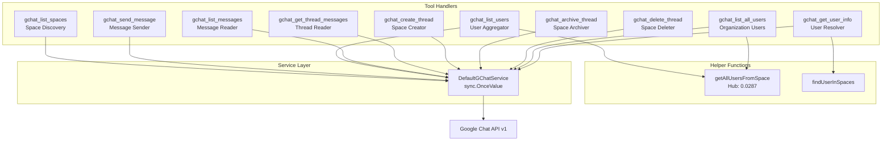
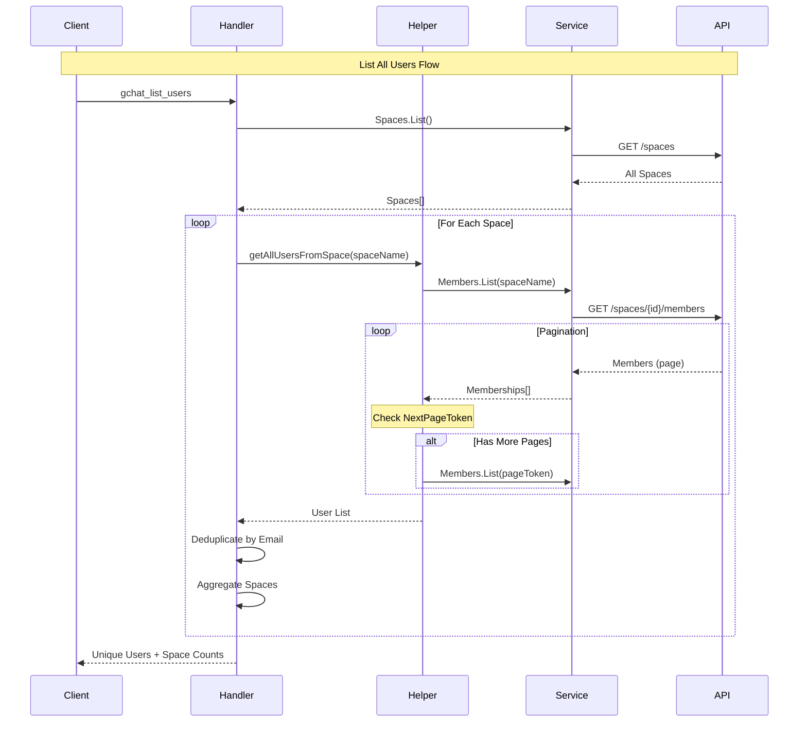
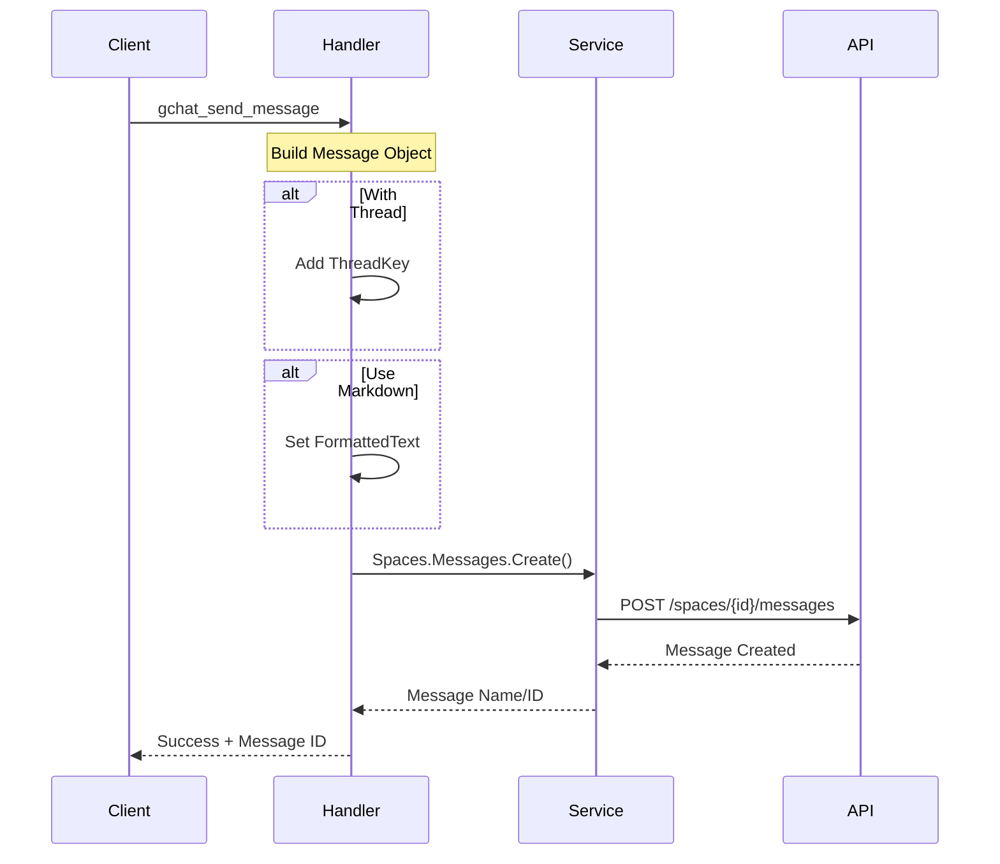

# Google Chat Tools Module

## Overview

The Google Chat module provides comprehensive team communication and collaboration capabilities for the MCP server, enabling space management, messaging, user operations, and thread handling through Google Chat's API. With 606 lines of code, it implements 10 tools that facilitate team coordination, user discovery, and message management across Google Chat spaces.

## Module Metrics

| Metric | Value |
|--------|-------|
| **Lines of Code** | 606 |
| **Number of Tools** | 10 |
| **Service Dependency** | `chat.Service` |
| **Key Hub Components** | `getAllUsersFromSpace` (PageRank: 0.0287) |
| **Complexity** | Medium-High (pagination, user aggregation) |

## Architecture

### Component Diagram



### Data Flow Patterns

#### User Aggregation Flow


#### Message Sending Flow


## Tools

### 1. gchat_list_spaces

**Description**: List all available Google Chat spaces/rooms accessible to the authenticated user.

**Parameters**: None

**Returns**:
```yaml
- name: spaces/AAAAA
  displayName: Team Discussion
  type: ROOM
- name: spaces/BBBBB
  displayName: Project Alpha
  type: ROOM
```

**Implementation Details**:
- Lists all spaces the user has access to
- Returns space name (identifier), display name, and type
- No pagination required at space level

**Example**:
```json
{
  "action": "gchat_list_spaces"
}
```

---

### 2. gchat_send_message

**Description**: Send a message to a Google Chat space or direct message, with optional thread support and markdown formatting.

**Parameters**:
| Parameter | Type | Required | Description |
|-----------|------|----------|-------------|
| `space_name` | string | Yes | Name of the space (e.g., "spaces/1234567890") |
| `message` | string | Yes | Text message to send |
| `thread_name` | string | No | Thread name to reply to (e.g., "spaces/1234567890/threads/abcdef") |
| `use_markdown` | boolean | No | Whether to format the message using markdown (default: false) |

**Returns**:
```
Message sent successfully. Message ID: spaces/1234567890/messages/xyz.abc
```

**Implementation Details**:
- Creates a `chat.Message` object with text content
- If `use_markdown` is true, sets `FormattedText` field for markdown rendering
- If `thread_name` is provided, uses `ThreadKey()` to reply in thread
- Returns the message ID for reference

**Example**:
```json
{
  "space_name": "spaces/1234567890",
  "message": "Hello team! Check out this **important** update.",
  "use_markdown": true
}
```

**Example (Thread Reply)**:
```json
{
  "space_name": "spaces/1234567890",
  "message": "I'll work on that today.",
  "thread_name": "spaces/1234567890/threads/abcdef"
}
```

---

### 3. gchat_list_users

**Description**: List all Google Chat users from all spaces in the organization, with deduplication and space membership tracking.

**Parameters**: None

**Returns**:
```yaml
users:
  - name: users/john@example.com
    displayName: John Doe
    type: HUMAN
    role: ROLE_MEMBER
    email: john@example.com
    spaces:
      - spaces/AAAAA
      - spaces/BBBBB
    spaceNames:
      - Team Discussion
      - Project Alpha
    spaceCount: 2
totalUsers: 45
totalSpaces: 8
```

**Implementation Details**:
- **Hub Component**: Uses `getAllUsersFromSpace` to fetch members from each space
- Iterates through all spaces accessible to the user
- Deduplicates users by email address across spaces
- Aggregates space membership for each user
- Tracks how many spaces each user is a member of
- Extracts email from user name (format: "users/email@domain.com")
- Handles pagination automatically for large member lists
- Continues on individual space failures to maximize data collection

**Pagination Behavior**:
```go
// getAllUsersFromSpace handles pagination internally
pageToken := ""
for {
    listCall := Members.List(spaceName).
        PageSize(1000).
        ShowGroups(true).
        UseAdminAccess(true)

    if pageToken != "" {
        listCall = listCall.PageToken(pageToken)
    }

    members, _ := listCall.Do()
    // Process members...

    if members.NextPageToken == "" {
        break
    }
    pageToken = members.NextPageToken
}
```

**Example Output**:
```json
{
  "totalUsers": 45,
  "totalSpaces": 8
}
```

---

### 4. gchat_list_messages

**Description**: Get messages from a Google Chat space with pagination support.

**Parameters**:
| Parameter | Type | Required | Description |
|-----------|------|----------|-------------|
| `space_name` | string | Yes | Name of the space (e.g., "spaces/1234567890") |
| `page_size` | number | No | Maximum number of messages to return (default: 100) |
| `page_token` | string | No | Page token for pagination |

**Returns**:
```yaml
messages:
  - name: spaces/1234567890/messages/abc.xyz
    sender:
      name: users/john@example.com
      displayName: John Doe
      type: HUMAN
    createTime: "2024-01-15T10:30:00Z"
    text: "Meeting notes from today"
    thread:
      name: spaces/1234567890/threads/thread123
    attachments:
      - name: spaces/1234567890/messages/abc.xyz/attachments/1
        contentName: report.pdf
        contentType: application/pdf
        source: UPLOADED_CONTENT
        thumbnailUri: https://...
        downloadUri: https://...
nextPageToken: NEXT_PAGE_TOKEN_HERE
```

**Implementation Details**:
- Orders messages by `createTime desc` (newest first)
- Extracts sender information, creation time, text content, and thread reference
- Includes attachment details if present (name, type, URIs)
- Returns `nextPageToken` for pagination
- Default page size: 100 messages

**Example**:
```json
{
  "space_name": "spaces/1234567890",
  "page_size": 50
}
```

**Example (Pagination)**:
```json
{
  "space_name": "spaces/1234567890",
  "page_size": 50,
  "page_token": "NEXT_PAGE_TOKEN_HERE"
}
```

---

### 5. gchat_create_thread

**Description**: Create a new Google Chat space/thread with multiple users and an optional initial message.

**Parameters**:
| Parameter | Type | Required | Description |
|-----------|------|----------|-------------|
| `display_name` | string | Yes | Display name for the new chat space |
| `user_emails` | string | Yes | Comma-separated list of user email addresses |
| `initial_message` | string | No | Optional initial message to send to the new chat space |
| `external_user_allowed` | boolean | No | Whether to allow users outside the domain (default: false) |

**Returns**:
```yaml
space:
  name: spaces/1234567890
  displayName: New Project Team
  type: ROOM
  spaceType: SPACE
  externalUserAllowed: false
members:
  successful:
    - alice@example.com
    - bob@example.com
  failed:
    - charlie@external.com: insufficient permissions
initialMessageId: spaces/1234567890/messages/abc.xyz
```

**Implementation Details**:
- Creates a ROOM/SPACE type space
- Parses comma-separated email addresses and trims whitespace
- Adds members individually, tracking success/failure
- Sends initial message after space creation if provided
- Returns detailed results including:
  - Space information (name, display name, type)
  - Successful and failed member additions with error details
  - Initial message ID if sent

**Member Addition Process**:
```go
for _, email := range emails {
    member := &chat.Membership{
        Member: &chat.User{
            Name: fmt.Sprintf("users/%s", email),
            Type: "HUMAN",
        },
    }
    // Track success/failure per user
}
```

**Example**:
```json
{
  "display_name": "New Project Team",
  "user_emails": "alice@example.com, bob@example.com, charlie@example.com",
  "initial_message": "Welcome to the team! Let's get started.",
  "external_user_allowed": false
}
```

---

### 6. gchat_archive_thread

**Description**: Archive a Google Chat space to make it read-only, preserving all messages and history.

**Parameters**:
| Parameter | Type | Required | Description |
|-----------|------|----------|-------------|
| `space_name` | string | Yes | Name of the space to archive (e.g., "spaces/1234567890") |

**Returns**:
```yaml
name: spaces/1234567890
displayName: Old Project
type: ROOM
spaceHistoryState: HISTORY_ON
archived: true
message: "Space archived successfully. The space is now read-only."
```

**Implementation Details**:
- Fetches current space configuration
- Updates `spaceHistoryState` to `HISTORY_ON`
- Uses PATCH request with `updateMask` for targeted update
- Space becomes read-only but accessible for viewing
- All message history is preserved

**Example**:
```json
{
  "space_name": "spaces/1234567890"
}
```

---

### 7. gchat_delete_thread

**Description**: Delete a Google Chat space permanently. This action cannot be undone.

**Parameters**:
| Parameter | Type | Required | Description |
|-----------|------|----------|-------------|
| `space_name` | string | Yes | Name of the space to delete (e.g., "spaces/1234567890") |

**Returns**:
```yaml
spaceName: spaces/1234567890
deleted: true
message: "Space deleted successfully. This action cannot be undone."
```

**Implementation Details**:
- Permanently deletes the space and all its contents
- All messages, attachments, and membership data are removed
- This action is irreversible

**Warning**: Use with caution as this permanently removes all space data.

**Example**:
```json
{
  "space_name": "spaces/1234567890"
}
```

---

### 8. gchat_list_all_users

**Description**: List all unique users and their email addresses across all Google Chat spaces. Functionally identical to `gchat_list_users`.

**Parameters**: None

**Returns**: Same as `gchat_list_users`

**Implementation Details**:
- This tool is an alias for `gchat_list_users`
- Provides the same functionality and output format
- Kept for backward compatibility and clearer naming

---

### 9. gchat_get_thread_messages

**Description**: Get messages from a specific Google Chat thread with pagination support.

**Parameters**:
| Parameter | Type | Required | Description |
|-----------|------|----------|-------------|
| `space_name` | string | Yes | Name of the space containing the thread (e.g., "spaces/1234567890") |
| `thread_name` | string | Yes | Name of the thread (e.g., "spaces/1234567890/threads/abcdef") |
| `page_size` | number | No | Maximum number of messages to return (default: 100) |
| `page_token` | string | No | Page token for pagination |

**Returns**:
```yaml
messages:
  - name: spaces/1234567890/messages/msg1
    sender:
      name: users/alice@example.com
      displayName: Alice
      type: HUMAN
    createTime: "2024-01-15T10:30:00Z"
    text: "Starting the discussion"
    thread:
      name: spaces/1234567890/threads/abcdef
  - name: spaces/1234567890/messages/msg2
    sender:
      name: users/bob@example.com
      displayName: Bob
      type: HUMAN
    createTime: "2024-01-15T10:35:00Z"
    text: "Great idea!"
    thread:
      name: spaces/1234567890/threads/abcdef
nextPageToken: NEXT_PAGE_TOKEN_HERE
threadName: spaces/1234567890/threads/abcdef
```

**Implementation Details**:
- Filters messages using thread name
- Orders by `createTime desc` (newest first)
- Includes attachment details if present
- Returns thread name for reference
- Supports pagination with `pageToken`

**Filter Query**:
```go
Filter(fmt.Sprintf("thread.name = %s", threadName))
```

**Example**:
```json
{
  "space_name": "spaces/1234567890",
  "thread_name": "spaces/1234567890/threads/abcdef",
  "page_size": 50
}
```

---

### 10. gchat_get_user_info

**Description**: Get username and display name for a Google Chat user by user ID.

**Parameters**:
| Parameter | Type | Required | Description |
|-----------|------|----------|-------------|
| `user_id` | string | Yes | Google Chat user ID in format "users/123456789" |

**Returns**:
```yaml
name: users/123456789
displayName: John Doe
type: HUMAN
```

**Implementation Details**:
- Validates user ID format (must start with "users/")
- Uses `findUserInSpaces` helper to search across all accessible spaces
- Searches through all spaces to find user membership
- Returns user information when found
- Returns error if user not found in accessible spaces

**Search Process**:
```go
func findUserInSpaces(targetUserID string) {
    // List all spaces
    for _, space := range spaces {
        // List members in each space
        for _, member := range members {
            if member.Member.Name == targetUserID {
                return member.Member // Found!
            }
        }
    }
    return nil // Not found
}
```

**Example**:
```json
{
  "user_id": "users/123456789"
}
```

**Error Cases**:
- Invalid user ID format: "Invalid user ID format. Must start with 'users/'"
- User not found: "User not found in accessible spaces"

## Helper Functions

### getAllUsersFromSpace (Hub Component)

**Signature**: `func getAllUsersFromSpace(spaceName, spaceDisplayName string) ([]map[string]interface{}, error)`

**PageRank**: 0.0287 (Hub component - called by multiple user listing tools)

**Description**: Fetches all members from a space with automatic pagination handling.

**Features**:
- Automatic pagination with 1000 members per page
- Includes group memberships
- Uses admin access for full visibility
- Extracts email addresses from user names
- Returns user information with role and type

**Pagination Logic**:
```go
for {
    listCall := Spaces.Members.List(spaceName).
        PageSize(1000).
        ShowGroups(true).
        UseAdminAccess(true)

    if pageToken != "" {
        listCall = listCall.PageToken(pageToken)
    }

    members, err := listCall.Do()
    // Process members...

    if members.NextPageToken == "" {
        break // No more pages
    }
    pageToken = members.NextPageToken
}
```

**Returns**:
```go
[]map[string]interface{}{
    {
        "name": "users/john@example.com",
        "displayName": "John Doe",
        "type": "HUMAN",
        "role": "ROLE_MEMBER",
        "email": "john@example.com",
    },
}
```

---

### findUserInSpaces

**Signature**: `func findUserInSpaces(targetUserID string) (map[string]interface{}, bool, error)`

**Description**: Searches for a specific user across all accessible spaces.

**Features**:
- Lists all spaces
- Searches through member lists of each space
- Returns user information when found
- Handles errors gracefully (continues on individual space failures)

**Return Values**:
- User information map if found
- Boolean indicating if user was found
- Error if spaces listing fails

**Usage**:
```go
userInfo, found, err := findUserInSpaces("users/123456789")
if !found {
    return error "User not found in accessible spaces"
}
```

## Service Layer

### DefaultGChatService

**Type**: `sync.OnceValue[*chat.Service]`

**Description**: Thread-safe singleton for Google Chat service initialization.

**Initialization**:
```go
func NewGChatService() (*chat.Service, error) {
    ctx := context.Background()

    // Get environment variables
    credentialsFile := os.Getenv("GOOGLE_CREDENTIALS_FILE")
    tokenFile := os.Getenv("GOOGLE_TOKEN_FILE")

    // Create HTTP client with OAuth credentials
    client := GoogleHttpClient(tokenFile, credentialsFile)

    // Initialize Chat service
    srv, err := chat.NewService(ctx, option.WithHTTPClient(client))
    return srv, err
}

var DefaultGChatService = sync.OnceValue[*chat.Service](func() *chat.Service {
    srv, err := NewGChatService()
    if err != nil {
        panic(fmt.Sprintf("failed to create chat service: %v", err))
    }
    return srv
})
```

**Features**:
- Lazy initialization on first access
- Thread-safe singleton pattern
- Panics on initialization failure for fail-fast behavior
- Reuses Google HTTP client with OAuth credentials

**Environment Variables Required**:
- `GOOGLE_CREDENTIALS_FILE`: Path to OAuth credentials JSON
- `GOOGLE_TOKEN_FILE`: Path to OAuth token JSON

## Error Handling

All tool handlers are wrapped with `util.ErrorGuard` for consistent error handling:

```go
s.AddTool(listSpacesTool, util.ErrorGuard(gChatListSpacesHandler))
```

### Error Handling Patterns

1. **API Errors**:
```go
spaces, err := services.DefaultGChatService().Spaces.List().Do()
if err != nil {
    return mcp.NewToolResultError(fmt.Sprintf("failed to list spaces: %v", err)), nil
}
```

2. **Validation Errors**:
```go
if !strings.HasPrefix(userID, "users/") {
    return mcp.NewToolResultError("Invalid user ID format. Must start with 'users/'"), nil
}
```

3. **Graceful Degradation** (User Listing):
```go
for _, space := range spaces.Spaces {
    spaceUsers, err := getAllUsersFromSpace(space.Name, space.DisplayName)
    if err != nil {
        continue // Continue with other spaces if one fails
    }
    // Process users...
}
```

4. **Partial Success Tracking** (Thread Creation):
```go
failedMembers := []string{}
successfulMembers := []string{}

for _, email := range emails {
    _, err := AddMember(email)
    if err != nil {
        failedMembers = append(failedMembers, fmt.Sprintf("%s: %v", email, err))
    } else {
        successfulMembers = append(successfulMembers, email)
    }
}
```

## Usage Examples

### Example 1: Team Coordination Workflow

```go
// 1. List all spaces
spaces := gchat_list_spaces()

// 2. Create a new project space
result := gchat_create_thread({
    "display_name": "Q1 2024 Planning",
    "user_emails": "alice@example.com, bob@example.com, charlie@example.com",
    "initial_message": "Welcome! Let's plan our Q1 goals.",
})

// 3. Send a message with markdown
gchat_send_message({
    "space_name": result.space.name,
    "message": "**Important**: Please review the attached roadmap by EOD.",
    "use_markdown": true,
})

// 4. List messages to see responses
messages := gchat_list_messages({
    "space_name": result.space.name,
    "page_size": 50,
})
```

### Example 2: User Discovery and Analysis

```go
// 1. Get all users across spaces
users := gchat_list_users()

// 2. Find users in multiple spaces (high engagement)
activeUsers := filter(users, user => user.spaceCount > 3)

// 3. Get detailed info for a specific user
userInfo := gchat_get_user_info({
    "user_id": "users/123456789",
})
```

### Example 3: Thread Management

```go
// 1. List messages in a space
messages := gchat_list_messages({
    "space_name": "spaces/1234567890",
    "page_size": 100,
})

// 2. Get messages from a specific thread
threadMessages := gchat_get_thread_messages({
    "space_name": "spaces/1234567890",
    "thread_name": "spaces/1234567890/threads/abcdef",
    "page_size": 50,
})

// 3. Reply to the thread
gchat_send_message({
    "space_name": "spaces/1234567890",
    "message": "I've completed the review.",
    "thread_name": "spaces/1234567890/threads/abcdef",
})
```

### Example 4: Space Lifecycle

```go
// 1. Create a temporary project space
space := gchat_create_thread({
    "display_name": "Sprint 42 Retrospective",
    "user_emails": "team@example.com",
    "initial_message": "Share your thoughts on the sprint!",
})

// 2. Use the space for discussions...
gchat_send_message({
    "space_name": space.space.name,
    "message": "Great teamwork this sprint!",
})

// 3. Archive when project completes
gchat_archive_thread({
    "space_name": space.space.name,
})

// 4. Or delete if no longer needed
gchat_delete_thread({
    "space_name": space.space.name,
})
```

## Performance Considerations

### Pagination Strategy

**User Listing Performance**:
- Uses page size of 1000 for member listings
- Automatic pagination reduces API calls
- Deduplication happens in memory (efficient for typical organization sizes)

```go
// Optimal for large spaces
PageSize(1000) // Maximum allowed
```

**Message Listing Performance**:
- Default page size: 100 messages
- Ordered by `createTime desc` (efficient index usage)
- Page tokens enable cursor-based pagination

### Caching

**Service Singleton**:
```go
var DefaultGChatService = sync.OnceValue[*chat.Service](...)
```
- Service initialized once per application lifecycle
- Thread-safe access across concurrent requests
- Reduces OAuth overhead

### Concurrency

**Safe for Concurrent Use**:
- All tool handlers are stateless
- Service singleton uses `sync.OnceValue` for thread-safe initialization
- No shared mutable state

## Integration Notes

### OAuth Scopes Required

The Google Chat tools require the following scopes (defined in `services/google.go`):

```go
func ListChatScopes() []string {
    return []string{
        "https://www.googleapis.com/auth/chat.admin.memberships",
        "https://www.googleapis.com/auth/chat.admin.memberships.readonly",
        "https://www.googleapis.com/auth/chat.admin.spaces",
        "https://www.googleapis.com/auth/chat.admin.spaces.readonly",
        "https://www.googleapis.com/auth/chat.memberships",
        "https://www.googleapis.com/auth/chat.memberships.app",
        "https://www.googleapis.com/auth/chat.memberships.readonly",
        "https://www.googleapis.com/auth/chat.messages",
        "https://www.googleapis.com/auth/chat.messages.create",
        "https://www.googleapis.com/auth/chat.messages.reactions",
        "https://www.googleapis.com/auth/chat.messages.reactions.create",
        "https://www.googleapis.com/auth/chat.messages.reactions.readonly",
        "https://www.googleapis.com/auth/chat.messages.readonly",
        "https://www.googleapis.com/auth/chat.spaces",
        "https://www.googleapis.com/auth/chat.spaces.create",
        "https://www.googleapis.com/auth/chat.spaces.readonly",
        "https://www.googleapis.com/auth/chat.users.readstate",
        "https://www.googleapis.com/auth/chat.users.readstate.readonly",
    }
}
```

### Admin Access

Several operations use `UseAdminAccess(true)` for full visibility:
- Member listings in `getAllUsersFromSpace`
- User discovery operations

**Requirements**:
- Service account must have domain-wide delegation
- Or user must have appropriate Google Workspace admin permissions

### External Users

When creating spaces with `external_user_allowed: true`:
- Allows users outside the organization domain
- Requires appropriate workspace settings
- May fail if domain policies restrict external sharing

## Best Practices

### 1. User Identification

Always use the full user ID format:
```go
// Correct
"user_id": "users/123456789"
"user_id": "users/john@example.com"

// Incorrect
"user_id": "123456789"
"user_id": "john@example.com"
```

### 2. Space Management

**Before deletion**:
```go
// Archive first to preserve history
gchat_archive_thread({"space_name": spaceName})

// Review archived space
messages := gchat_list_messages({"space_name": spaceName})

// Only then delete if truly not needed
gchat_delete_thread({"space_name": spaceName})
```

### 3. Pagination

For large result sets:
```go
// Initial request
result := gchat_list_messages({
    "space_name": "spaces/1234567890",
    "page_size": 100,
})

// Subsequent pages
while (result.nextPageToken) {
    result = gchat_list_messages({
        "space_name": "spaces/1234567890",
        "page_size": 100,
        "page_token": result.nextPageToken,
    })
}
```

### 4. Error Handling

Handle partial failures gracefully:
```go
// Thread creation may have partial success
result := gchat_create_thread({...})

if (result.members.failed.length > 0) {
    // Log or retry failed members
    console.log("Failed to add:", result.members.failed)
}

// Proceed with successful members
console.log("Space created with:", result.members.successful)
```

### 5. Markdown Formatting

Use markdown flag for rich text:
```go
gchat_send_message({
    "space_name": "spaces/1234567890",
    "message": "**Bold** *italic* `code` [link](url)",
    "use_markdown": true,
})
```

## Troubleshooting

### Common Issues

**1. "User not found in accessible spaces"**
- User may not be in any space you have access to
- User ID format may be incorrect (must start with "users/")
- User may have been removed from all spaces

**2. "Failed to add member"**
- Email address may be invalid
- External users may be blocked by domain policy
- User may already be in the space
- Insufficient permissions to add members

**3. "Failed to list spaces"**
- OAuth token may be expired
- Required scopes may not be granted
- Service account may lack domain-wide delegation

**4. Pagination issues**
- Always check for `nextPageToken` in response
- Don't assume all results fit in one page
- Use appropriate page size for your use case

### Debug Tips

**Enable verbose logging**:
```go
// Log service initialization
srv := services.DefaultGChatService()
fmt.Printf("Chat service initialized: %+v\n", srv)
```

**Inspect API responses**:
```go
// Check raw API responses
resp, err := service.Spaces.List().Do()
fmt.Printf("API Response: %+v\n", resp)
```

**Verify user format**:
```go
// Ensure user IDs are in correct format
if !strings.HasPrefix(userID, "users/") {
    fmt.Printf("Invalid user ID: %s\n", userID)
}
```

## Related Modules

- **services/gchat.go**: Service initialization and OAuth client setup
- **services/google.go**: Shared Google HTTP client and scope management
- **util/handler.go**: Error handling wrapper (`ErrorGuard`)

## API Reference

- [Google Chat API Documentation](https://developers.google.com/chat)
- [Spaces API Reference](https://developers.google.com/chat/api/reference/rest/v1/spaces)
- [Messages API Reference](https://developers.google.com/chat/api/reference/rest/v1/spaces.messages)
- [Memberships API Reference](https://developers.google.com/chat/api/reference/rest/v1/spaces.members)
