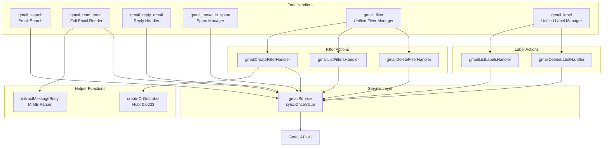
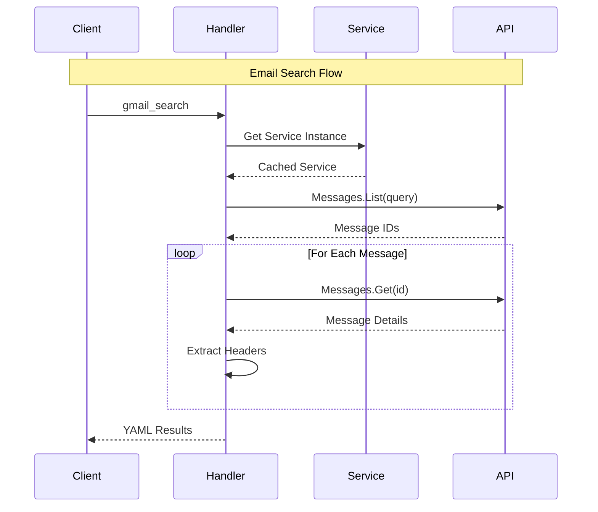
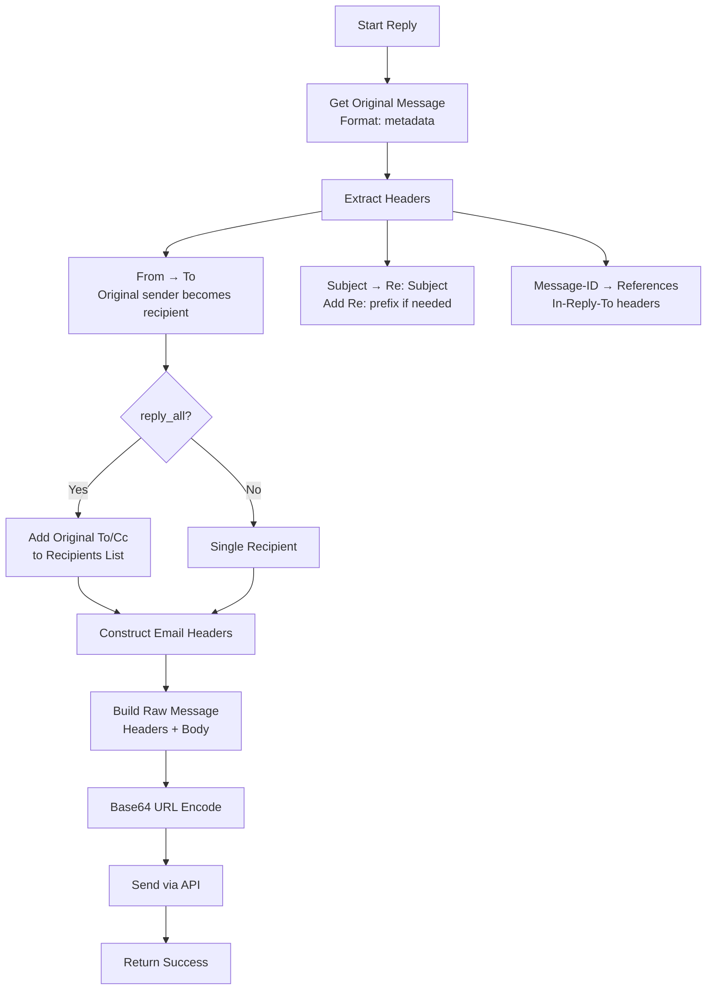
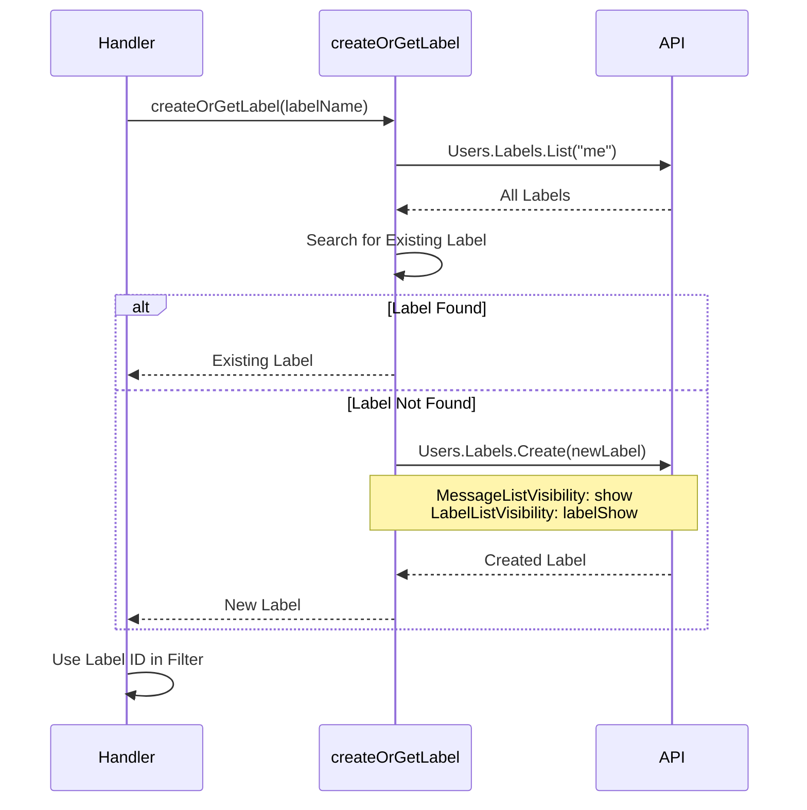
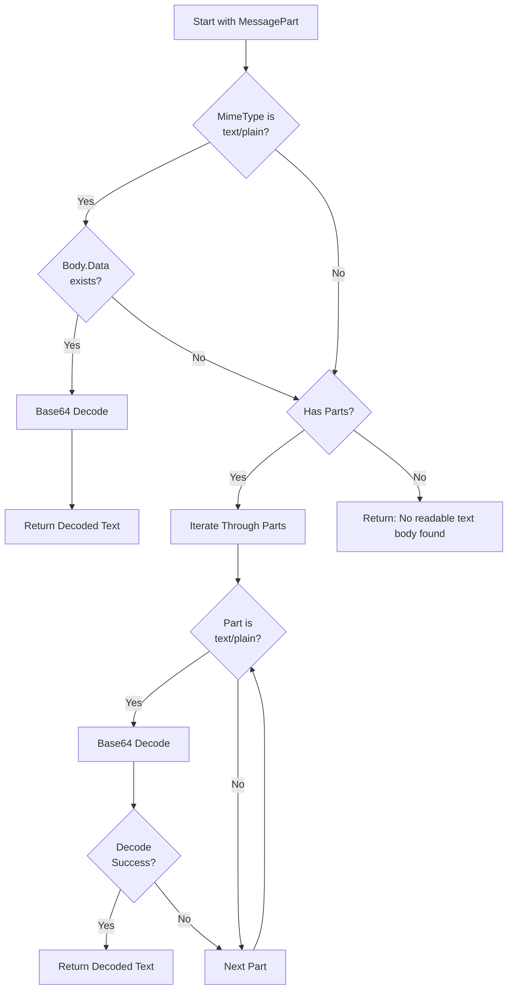
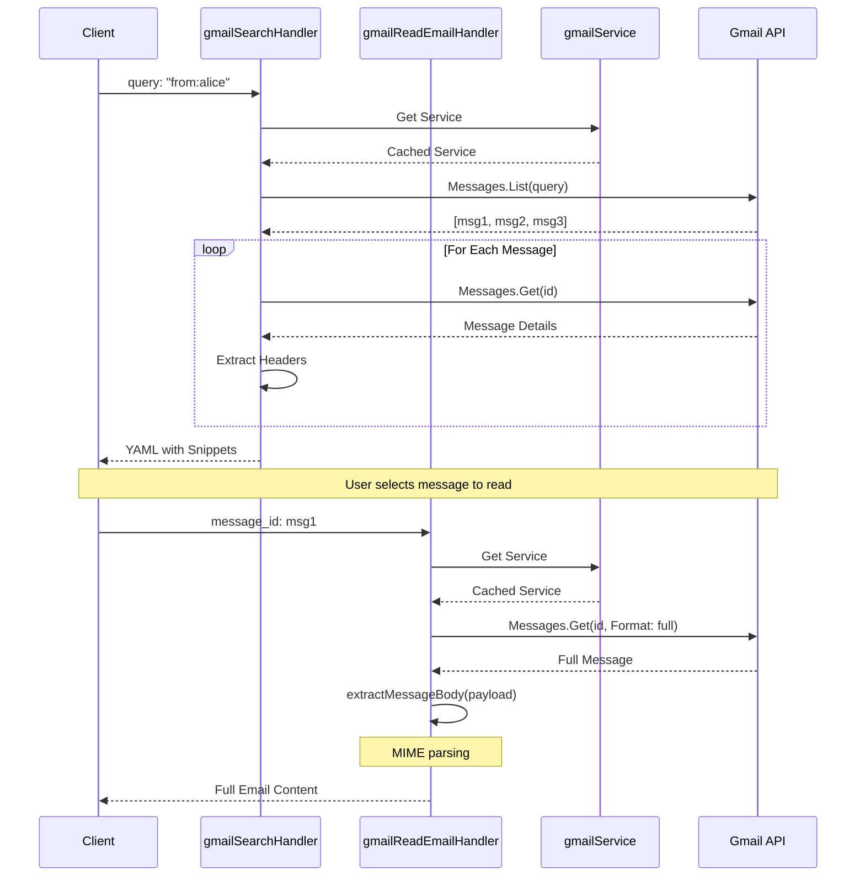
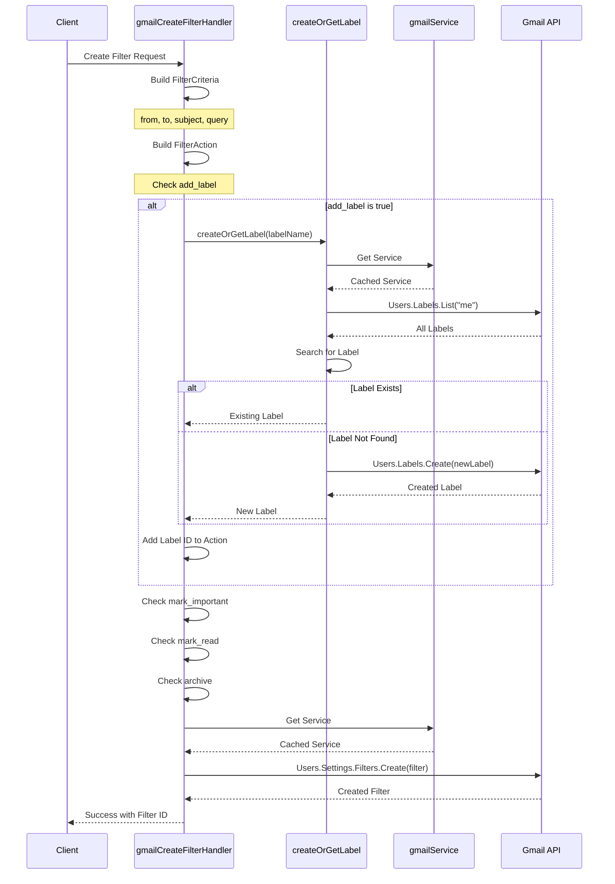

# Gmail Tools Module

## Overview

The Gmail module provides comprehensive email management capabilities for the MCP server, enabling search, reading, replying, filtering, and label management through Gmail's API. With 593 lines of code, it implements 8 tools organized into unified filter and label management interfaces.

## Module Metrics

| Metric | Value |
|--------|-------|
| **Lines of Code** | 593 |
| **Number of Tools** | 6 (8 sub-actions) |
| **Service Dependency** | `gmail.Service` |
| **Key Hub Components** | `createOrGetLabel` (PageRank: 0.0233) |
| **Complexity** | Medium (message parsing, MIME handling) |

## Architecture

### Component Diagram



### Data Flow Patterns



## Tools

### 1. gmail_search

**Description**: Search emails using Gmail's powerful search syntax.

**Parameters**:
| Parameter | Type | Required | Description |
|-----------|------|----------|-------------|
| `query` | string | Yes | Gmail search query (uses Gmail search syntax) |

**Search Syntax Examples**:
- `from:alice@example.com` - Emails from specific sender
- `subject:"meeting notes"` - Subject contains phrase
- `has:attachment after:2024/01/01` - With attachments after date
- `is:unread category:promotions` - Unread promotional emails
- `to:me cc:bob@example.com` - Emails to me with Bob CC'd

**Implementation Details**:
- Fetches up to 10 messages by default (`MaxResults(10)`)
- For each result, retrieves full message details
- Extracts key headers: From, Subject, Date
- Includes message snippet for preview
- Continues on individual message fetch errors (logs warning)

**Response Format** (YAML):
```yaml
count: 3
emails:
  - id: "18d1a2b3c4d5e6f7"
    from: "alice@example.com"
    subject: "Q1 Planning"
    date: "Mon, 15 Jan 2024 14:30:00 -0800"
    snippet: "Let's schedule a meeting to discuss..."
  - id: "18d1a2b3c4d5e6f8"
    from: "bob@example.com"
    subject: "Code Review Request"
    date: "Tue, 16 Jan 2024 09:15:00 -0800"
    snippet: "Please review PR #123..."
```

**Error Handling**:
- Invalid query → API error returned
- Message fetch failure → Logged, continues with other messages
- No results → Returns `count: 0` with empty `emails` array

### 2. gmail_read_email

**Description**: Read a specific email's full content including headers, body, and optionally attachments.

**Parameters**:
| Parameter | Type | Required | Description |
|-----------|------|----------|-------------|
| `message_id` | string | Yes | ID of the message to read |
| `include_attachments` | boolean | No | Whether to include attachment info |

**Implementation Details**:
- Uses `Format("full")` to get complete message data
- Extracts headers: From, To, Cc, Subject, Date
- Calls `extractMessageBody()` for MIME parsing
- Lists attachment metadata (filename, size) without downloading data

**Response Format** (YAML):
```yaml
id: "18d1a2b3c4d5e6f7"
headers:
  From: "alice@example.com"
  To: "me@example.com"
  Subject: "Project Update"
  Date: "Mon, 15 Jan 2024 14:30:00 -0800"
  Cc: "team@example.com"
body: |
  Hi team,

  Here's the latest update on the project...
attachments:
  - filename: "report.pdf"
    size: 524288
  - filename: "chart.png"
    size: 102400
```

**MIME Handling**:
- Prefers `text/plain` parts
- Recursively searches message parts
- Base64 URL decoding of body data
- Falls back to "No readable text body found" if no text/plain found

### 3. gmail_reply_email

**Description**: Reply to a specific email with support for reply-all functionality.

**Parameters**:
| Parameter | Type | Required | Description |
|-----------|------|----------|-------------|
| `message_id` | string | Yes | ID of the message to reply to |
| `reply_text` | string | Yes | Text content of the reply |
| `reply_all` | boolean | No | Whether to reply to all recipients |

**Email Threading Implementation**:



**Headers Constructed**:
- `To`: Original sender (+ others if reply-all)
- `Subject`: Original subject with "Re:" prefix
- `References`: Original Message-ID + previous references
- `In-Reply-To`: Original Message-ID

**Reply-All Logic**:
1. Original sender always included
2. Parses `To` field from original message
3. Adds all recipients except "me@" addresses
4. Comma-separated recipient list

**Response**:
```
Successfully replied to email with ID: 18d1a2b3c4d5e6f7
```

**Edge Cases**:
- Subject already has "Re:" → Doesn't add duplicate
- Reply-all with no other recipients → Works as simple reply
- Missing Message-ID → Empty References/In-Reply-To (still works)

### 4. gmail_move_to_spam

**Description**: Move one or multiple emails to spam folder by message IDs.

**Parameters**:
| Parameter | Type | Required | Description |
|-----------|------|----------|-------------|
| `message_ids` | string | Yes | Comma-separated list of message IDs |

**Implementation**:
- Splits CSV string into individual message IDs
- For each ID, modifies message to add "SPAM" label
- Fails on first error (no partial success)
- Uses Gmail's label system (SPAM is a system label)

**Example**:
```json
{
  "message_ids": "18d1a2b3c4d5e6f7,18d1a2b3c4d5e6f8,18d1a2b3c4d5e6f9"
}
```

**Response**:
```
Successfully moved 3 emails to spam.
```

**Error Handling**:
- Empty message_ids → Error: "no message IDs provided"
- Invalid message ID → Error with specific ID
- Permission denied → API error returned

### 5. gmail_filter

**Description**: Unified tool for managing Gmail filters with create, list, and delete actions.

#### Actions

##### create
Create a new filter with criteria and actions.

**Parameters**:
| Parameter | Type | Required | Description |
|-----------|------|----------|-------------|
| `action` | string | Yes | Must be "create" |
| `from` | string | No | Filter by sender |
| `to` | string | No | Filter by recipient |
| `subject` | string | No | Filter by subject |
| `query` | string | No | Additional search query |
| `add_label` | boolean | No | Add label to matching messages |
| `label_name` | string | Conditional | Required if `add_label` is true |
| `mark_important` | boolean | No | Mark matching as important |
| `mark_read` | boolean | No | Mark matching as read |
| `archive` | boolean | No | Archive matching messages |

**Filter Criteria**:
- Multiple criteria are AND'ed together
- Empty criteria → filter matches all mail (dangerous!)
- Supports Gmail's full query syntax in `query` field

**Filter Actions**:
| Action | Implementation | Gmail Label |
|--------|----------------|-------------|
| `add_label` | `AddLabelIds: [labelId]` | Custom label (created if needed) |
| `mark_important` | `AddLabelIds: ["IMPORTANT"]` | System label |
| `mark_read` | `RemoveLabelIds: ["UNREAD"]` | System label |
| `archive` | `RemoveLabelIds: ["INBOX"]` | System label |

**Label Creation Flow**:



**Example**:
```json
{
  "action": "create",
  "from": "notifications@github.com",
  "subject": "Pull Request",
  "add_label": true,
  "label_name": "GitHub PRs",
  "mark_important": true,
  "archive": false
}
```

**Response**:
```
Successfully created filter with ID: ANe1Bmj8xKz...
```

##### list
List all Gmail filters.

**Parameters**:
| Parameter | Type | Required | Description |
|-----------|------|----------|-------------|
| `action` | string | Yes | Must be "list" |

**Response Format** (YAML):
```yaml
count: 2
filters:
  - id: "ANe1Bmj8xKz..."
    criteria:
      from: "notifications@github.com"
      subject: "Pull Request"
    actions:
      addLabels:
        - "Label_123"
        - "IMPORTANT"
  - id: "ANe1Bmj8xKz..."
    criteria:
      to: "team@example.com"
    actions:
      removeLabels:
        - "INBOX"
```

**Implementation**:
- Fetches all filters for user
- Organizes criteria and actions into nested maps
- Omits empty criteria/actions
- Returns both custom and system label IDs

##### delete
Delete a filter by ID.

**Parameters**:
| Parameter | Type | Required | Description |
|-----------|------|----------|-------------|
| `action` | string | Yes | Must be "delete" |
| `filter_id` | string | Yes | ID of filter to delete |

**Response**:
```
Successfully deleted filter with ID: ANe1Bmj8xKz...
```

**Validation**:
- Empty filter_id → Error: "filter_id cannot be empty"
- Invalid filter_id → API error

### 6. gmail_label

**Description**: Unified tool for managing Gmail labels with list and delete actions.

#### Actions

##### list
List all Gmail labels (system and user-created).

**Parameters**:
| Parameter | Type | Required | Description |
|-----------|------|----------|-------------|
| `action` | string | Yes | Must be "list" |

**Response Format** (YAML):
```yaml
count: 15
systemLabels:
  - id: "INBOX"
    name: "INBOX"
    messagesTotal: 42
  - id: "SENT"
    name: "SENT"
    messagesTotal: 128
  - id: "SPAM"
    name: "SPAM"
    messagesTotal: 5
userLabels:
  - id: "Label_123"
    name: "Work Projects"
    messagesTotal: 67
  - id: "Label_456"
    name: "Personal"
    messagesTotal: 23
```

**Implementation**:
- Separates system labels from user labels
- Includes message count (`messagesTotal`) if > 0
- Returns organized structure for easy consumption

##### delete
Delete a user-created label by ID.

**Parameters**:
| Parameter | Type | Required | Description |
|-----------|------|----------|-------------|
| `action` | string | Yes | Must be "delete" |
| `label_id` | string | Yes | ID of label to delete |

**Response**:
```
Successfully deleted label with ID: Label_123
```

**Important Notes**:
- **Cannot delete system labels** (INBOX, SENT, etc.)
- Attempting to delete system label → API error
- Deleting label doesn't delete messages, only removes label
- Empty label_id → Error: "label_id cannot be empty"

## Helper Functions

### createOrGetLabel

**Signature**: `func createOrGetLabel(name string) (*gmail.Label, error)`

**Purpose**: Idempotent label creation - returns existing label if found, creates new if not.

**Metrics**:
- **PageRank**: 0.0233 (Hub component)
- **Complexity Score**: 21.48
- **Called By**: `gmailCreateFilterHandler`

**Implementation**:

```go
func createOrGetLabel(name string) (*gmail.Label, error) {
    // First try to find existing label
    labels, err := gmailService().Users.Labels.List("me").Do()
    if err != nil {
        return nil, fmt.Errorf("failed to list labels: %v", err)
    }

    for _, label := range labels.Labels {
        if label.Name == name {
            return label, nil
        }
    }

    // If not found, create new label
    newLabel := &gmail.Label{
        Name:                  name,
        MessageListVisibility: "show",
        LabelListVisibility:   "labelShow",
    }

    label, err := gmailService().Users.Labels.Create("me", newLabel).Do()
    if err != nil {
        return nil, fmt.Errorf("failed to create label: %v", err)
    }

    return label, nil
}
```

**Label Visibility Settings**:
- `MessageListVisibility: "show"` - Messages appear in message list
- `LabelListVisibility: "labelShow"` - Label appears in label list

**Error Handling**:
- List failure → Returns error
- Create failure → Returns error
- Duplicate name → Returns existing (idempotent)

**Performance**: O(n) where n = total number of labels (requires full list scan)

### extractMessageBody

**Signature**: `func extractMessageBody(payload *gmail.MessagePart) string`

**Purpose**: Extract plain text body from MIME message structure.

**MIME Parsing Strategy**:



**Algorithm**:
1. **Check top-level**: If payload itself is `text/plain` with data, decode and return
2. **Check parts**: If payload has parts, iterate through them
3. **Find text/plain**: Return first `text/plain` part that decodes successfully
4. **Fallback**: Return "No readable text body found"

**Implementation Details**:
- Uses `base64.URLEncoding` (Gmail uses URL-safe encoding)
- Silently skips decode errors in parts (continues searching)
- Prefers plain text over HTML
- Doesn't handle HTML parsing

**Edge Cases**:
- HTML-only emails → Returns "No readable text body found"
- Multipart/alternative → Returns first text/plain part
- Decode failure → Error message or continues searching
- Empty body → Returns "No readable text body found"

## Service Initialization

### gmailService

**Pattern**: `sync.OnceValue` for thread-safe lazy initialization

```go
var gmailService = sync.OnceValue[*gmail.Service](func() *gmail.Service {
    ctx := context.Background()

    tokenFile := os.Getenv("GOOGLE_TOKEN_FILE")
    if tokenFile == "" {
        panic("GOOGLE_TOKEN_FILE environment variable must be set")
    }

    credentialsFile := os.Getenv("GOOGLE_CREDENTIALS_FILE")
    if credentialsFile == "" {
        panic("GOOGLE_CREDENTIALS_FILE environment variable must be set")
    }

    client := services.GoogleHttpClient(tokenFile, credentialsFile)

    srv, err := gmail.NewService(ctx, option.WithHTTPClient(client))
    if err != nil {
        panic(fmt.Sprintf("failed to create Gmail service: %v", err))
    }

    return srv
})
```

**Lifecycle**:
1. **First Call**: Reads credentials, creates service, caches result
2. **Subsequent Calls**: Returns cached service (no I/O)
3. **Thread Safety**: `sync.OnceValue` ensures single initialization

**Error Strategy**:
- Missing env vars → Panic (fail-fast)
- Service creation failure → Panic with message
- Runtime API errors → Propagated to handlers

## Data Flow Examples

### Search and Read Flow



### Filter Creation Flow



## Error Handling

### Error Categories

| Error Type | Handler Behavior | Example |
|------------|-----------------|---------|
| **Type Validation** | Return MCP error immediately | `query must be a string` |
| **Empty Required Fields** | Return MCP error | `filter_id cannot be empty` |
| **API Errors** | Wrap and return as MCP error | `failed to create filter: permission denied` |
| **Decode Errors** | Log and continue (search) or return message | `Error decoding body: ...` |
| **Service Initialization** | Panic (fail-fast) | `GOOGLE_TOKEN_FILE must be set` |

### Error Messages

All API errors are wrapped with context:
```go
return mcp.NewToolResultError(fmt.Sprintf("failed to create filter: %v", err)), nil
```

**ErrorGuard Wrapper** ensures:
- Panics recovered with stack traces
- Consistent error formatting
- Actionable client messages

## Performance Considerations

### Optimization Strategies

1. **Service Caching**: `sync.OnceValue` prevents repeated initialization
2. **Partial Results**: Search continues on individual message failures
3. **Format Parameter**: Use `metadata` vs `full` based on needs
4. **Label Reuse**: `createOrGetLabel` prevents duplicate creation
5. **Lazy Attachment Loading**: Only fetches metadata, not content

### API Call Analysis

| Operation | API Calls | Notes |
|-----------|-----------|-------|
| **Search** | 1 + n | List + Get for each message (n ≤ 10) |
| **Read Email** | 1 | Single Get with full format |
| **Reply Email** | 2 | Get metadata + Send |
| **Move to Spam** | n | Modify for each message |
| **Create Filter (new label)** | 3 | List labels + Create label + Create filter |
| **Create Filter (existing label)** | 2 | List labels + Create filter |
| **List Filters** | 1 | Single list call |
| **Delete Filter** | 1 | Single delete call |
| **List Labels** | 1 | Single list call |

**Bottlenecks**:
- **Search**: O(n) API calls where n = number of results
- **createOrGetLabel**: O(n) where n = total labels (linear search)

### Potential Optimizations

1. **Batch Message Fetch**: Use `BatchGet` instead of individual Gets
2. **Label Caching**: Cache label list to avoid repeated lookups
3. **Parallel Search**: Fetch message details concurrently
4. **Label Map**: Build name→ID map for O(1) lookups

## Usage Examples

### Example 1: Search for Recent Unread Emails

```json
{
  "query": "is:unread after:2024/01/01 has:attachment"
}
```

### Example 2: Create Auto-Filing Filter

```json
{
  "action": "create",
  "from": "noreply@github.com",
  "add_label": true,
  "label_name": "GitHub",
  "archive": true,
  "mark_read": false
}
```

### Example 3: Read Email with Attachments

```json
{
  "message_id": "18d1a2b3c4d5e6f7",
  "include_attachments": true
}
```

### Example 4: Reply to All Recipients

```json
{
  "message_id": "18d1a2b3c4d5e6f7",
  "reply_text": "Thank you for the update. I'll review the documents and get back to you by Friday.",
  "reply_all": true
}
```

### Example 5: Bulk Spam Cleanup

```json
{
  "message_ids": "id1,id2,id3,id4,id5"
}
```

## Security Considerations

### Email Content

- **Base64 Decoding**: Uses URL-safe encoding (Gmail standard)
- **Header Injection**: Not vulnerable (API handles encoding)
- **XSS Risk**: Plain text only, no HTML rendering

### Label Management

- **System Labels**: Protected by API, cannot delete
- **Label Names**: No validation on name format
- **Visibility**: New labels visible in message and label lists

### Filter Creation

- **Criteria**: Empty criteria matches all mail (dangerous)
- **Actions**: Irreversible (can't undo auto-archiving)
- **Label Creation**: No limit checking

## Testing Considerations

### Test Scenarios

1. **Search**:
   - Various query syntaxes
   - No results
   - Individual message fetch failures
   - Large result sets

2. **Email Reading**:
   - Plain text emails
   - Multipart MIME
   - HTML-only emails
   - Attachments of various types
   - Corrupt/invalid encoding

3. **Reply**:
   - Simple reply
   - Reply-all
   - Missing headers
   - Subject with/without "Re:"
   - Threading headers

4. **Filters**:
   - Multiple criteria
   - Multiple actions
   - New label creation
   - Existing label reuse
   - Invalid filter IDs

5. **Labels**:
   - List system vs user labels
   - Delete user label
   - Attempt to delete system label
   - Empty message counts

## Integration

### Dependencies

- **Gmail API v1**: Email operations, filters, labels
- **MCP Server**: Tool registration and result formatting
- **Services Layer**: OAuth client and service initialization
- **Utilities**: ErrorGuard for error handling
- **YAML**: Response formatting
- **Base64**: Message encoding/decoding

### Registration

```go
func RegisterGmailTools(s *server.MCPServer) {
    searchTool := mcp.NewTool("gmail_search", ...)
    s.AddTool(searchTool, util.ErrorGuard(gmailSearchHandler))

    readEmailTool := mcp.NewTool("gmail_read_email", ...)
    s.AddTool(readEmailTool, util.ErrorGuard(gmailReadEmailHandler))

    // ... additional tools
}
```

## Future Improvements

1. **Performance**:
   - Implement batch message fetching
   - Cache label list
   - Parallel message detail fetching

2. **Features**:
   - HTML email support
   - Attachment download
   - Draft creation/management
   - Send new email (not just reply)
   - Advanced label operations (rename, color)
   - Thread management
   - Message modification (add/remove labels)

3. **UX**:
   - Pagination for large result sets
   - More flexible date filters
   - Template support for replies
   - Signature handling

4. **Robustness**:
   - Retry logic for transient failures
   - Rate limiting awareness
   - Better MIME type handling (HTML fallback)
   - Validate filter criteria before creation

## Related Documentation

- [Main Documentation](google-mcp.md)
- [Services Layer](services.md)
- [Utilities](utilities.md)
- [Gmail API Reference](https://developers.google.com/gmail/api/reference/rest)
