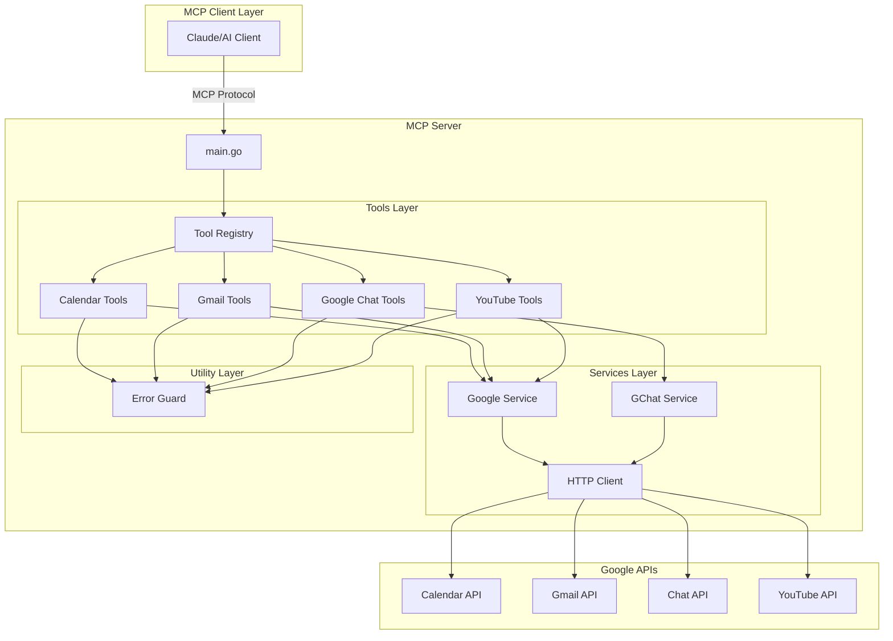
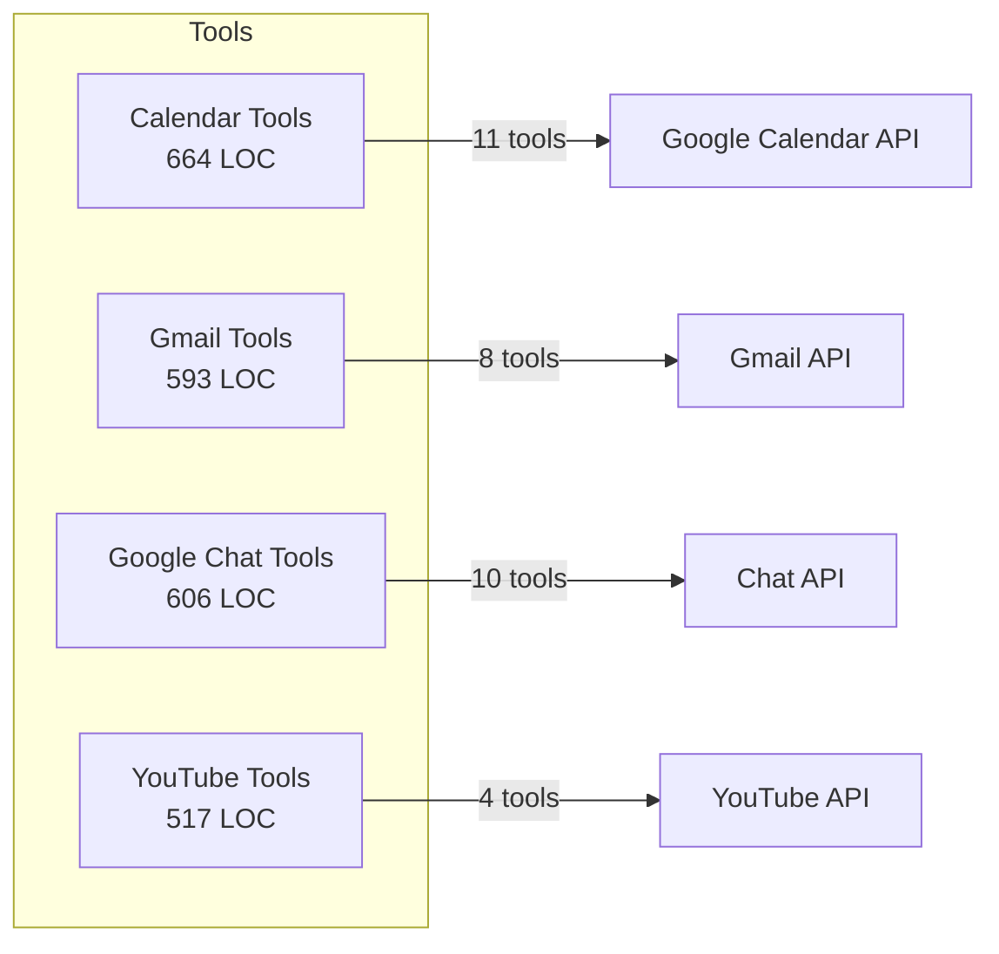
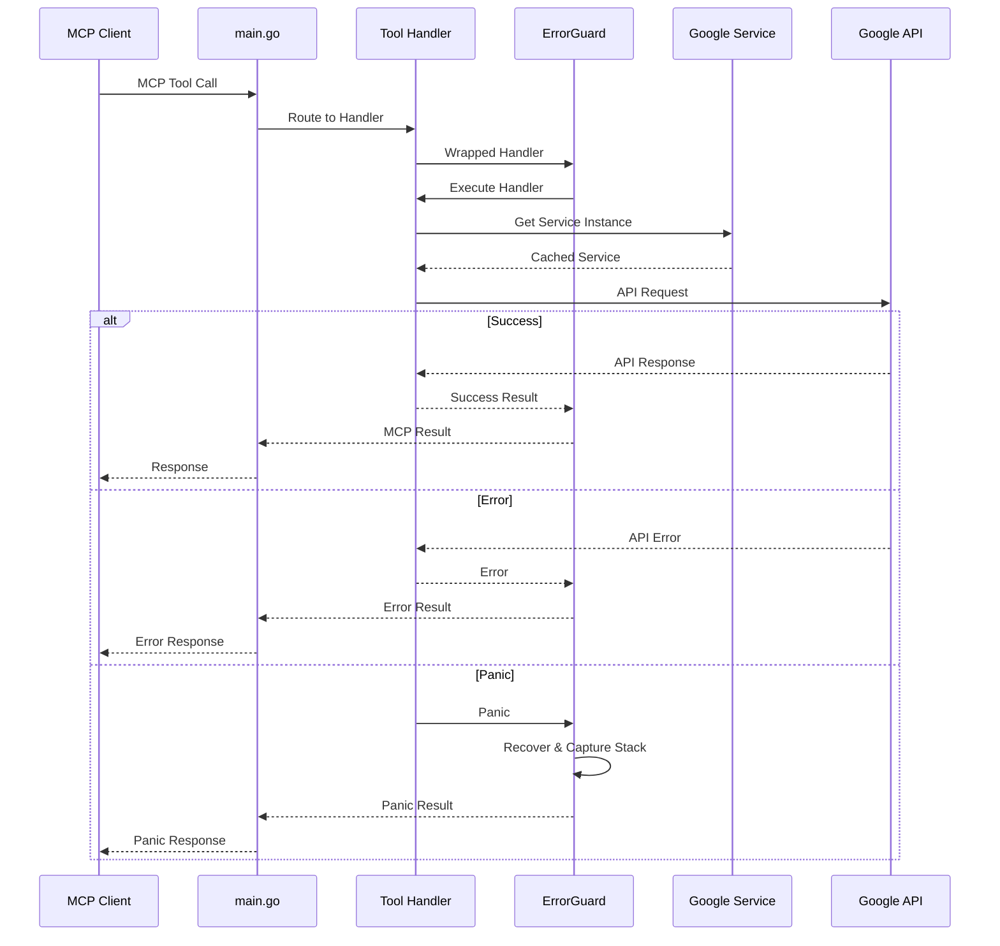
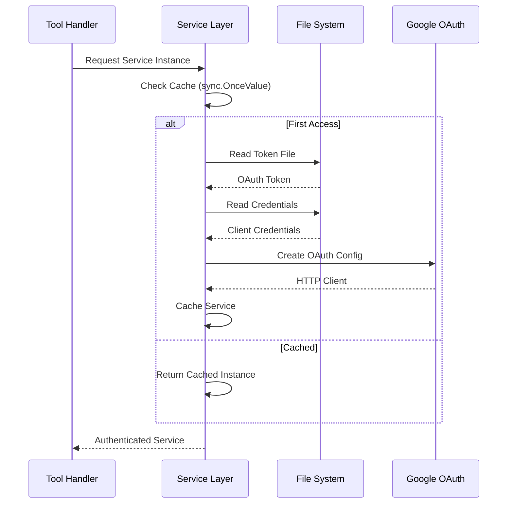
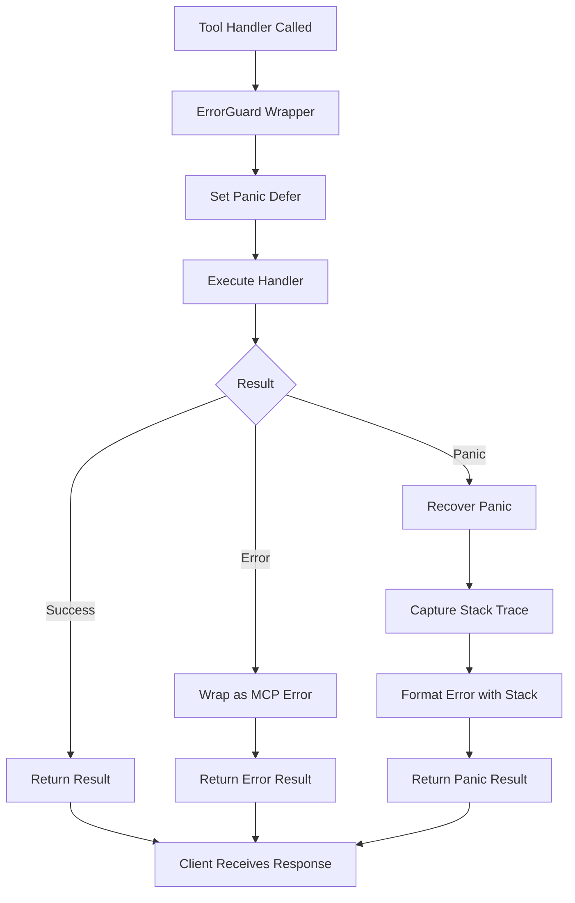
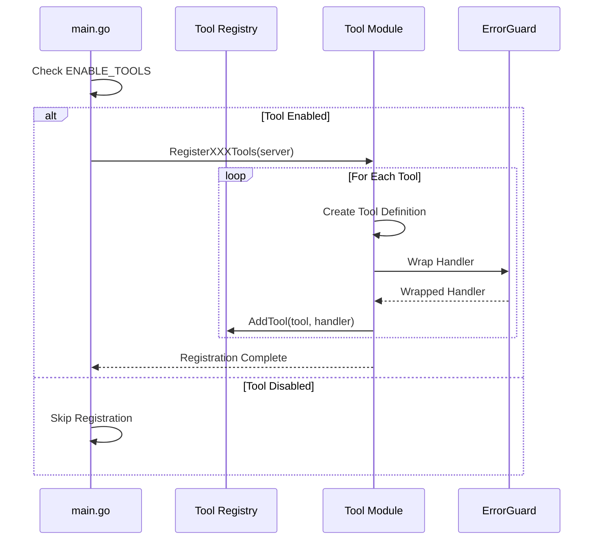

# Google MCP - Model Context Protocol Server

## Overview

Google MCP is a Model Context Protocol (MCP) implementation that enables AI models to interact seamlessly with Google Workspace services through a standardized interface. The server provides a unified way to access Google Calendar, Gmail, Google Chat, and YouTube APIs via MCP tools.

### Purpose

- **Unified Interface**: Single MCP server for multiple Google services
- **Modular Design**: Enable/disable specific tool groups based on requirements
- **Secure Authentication**: OAuth 2.0 based authentication with Google Cloud
- **Error Resilience**: Built-in error handling and recovery mechanisms

### Key Features

- **Google Calendar**: Event management, scheduling, availability checking
- **Gmail**: Email operations, filtering, label management
- **Google Chat**: Space management, messaging, user operations
- **YouTube**: Video management, comments, captions
- **Flexible Configuration**: Environment-based tool enablement

## System Architecture

### High-Level Architecture



### Component Overview

| Component | Purpose | Key Responsibilities |
|-----------|---------|---------------------|
| **main.go** | Entry point | Server initialization, tool registration, configuration |
| [**Calendar Tools**](calendar.md) | Calendar operations | Event CRUD, scheduling, availability |
| [**Gmail Tools**](gmail.md) | Email management | Search, filters, labels, messaging |
| [**Google Chat Tools**](gchat.md) | Chat operations | Spaces, messages, threads, users |
| [**YouTube Tools**](youtube.md) | Video management | Videos, comments, captions |
| [**Services Layer**](services.md) | API clients | Authentication, HTTP clients, scopes |
| [**Utilities**](utilities.md) | Cross-cutting concerns | Error handling, panic recovery |

### Architectural Metrics

Based on static analysis, the following components are architecturally critical:

#### Hub Components (High Centrality)

| Component | PageRank | Fan-In | Fan-Out | Role |
|-----------|----------|--------|---------|------|
| **util.handler.ErrorGuard** | 0.0587 | 5 | 0 | Central error handling wrapper used by all tool handlers |
| **services.google.ListChatScopes** | 0.0282 | 1 | 0 | Scope definition for Chat API authentication |
| **tools.gchat.getAllUsersFromSpace** | 0.0287 | 1 | 0 | User aggregation across Chat spaces |
| **tools.calendar.parseTimeString** | 0.0247 | 1 | 0 | Time parsing utility for calendar operations |
| **tools.gmail.createOrGetLabel** | 0.0233 | 1 | 0 | Label management helper |
| **services.google.GoogleHttpClient** | 0.0207 | 1 | 2 | HTTP client factory with OAuth |
| **services.google.ListGoogleScopes** | 0.0200 | 2 | 1 | Comprehensive scope aggregation |

**Key Insight**: The `ErrorGuard` utility is the most critical component with highest PageRank (0.0587) and fan-in (5), serving as the central error handling mechanism for all tool handlers. Any changes to this component affect the entire system.

## Module Structure

### Tool Modules

The system is organized into four primary tool modules:



#### 1. [Calendar Tools](calendar.md)
- **Lines of Code**: 664
- **Tools**: 11 tools for event management and scheduling
- **Key Features**:
  - Unified event management (create, update, list, respond)
  - Smart time slot finding with availability checking
  - Busy time analysis for multiple users
  - Working hours and duration-based scheduling

#### 2. [Gmail Tools](gmail.md)
- **Lines of Code**: 593
- **Tools**: 8 tools for email operations
- **Key Features**:
  - Advanced email search with Gmail query syntax
  - Email reading with attachment handling
  - Reply and reply-all functionality
  - Filter and label management
  - Spam handling

#### 3. [Google Chat Tools](gchat.md)
- **Lines of Code**: 606
- **Tools**: 10 tools for chat operations
- **Key Features**:
  - Space and thread management
  - Message sending with markdown support
  - User discovery and info retrieval
  - Thread archival and deletion
  - Organization-wide user listing

#### 4. [YouTube Tools](youtube.md)
- **Lines of Code**: 517
- **Tools**: 4 unified tools (video, comments, captions, update)
- **Key Features**:
  - Video listing and metadata retrieval
  - Video metadata updates
  - Comment management (list, post, reply)
  - Caption/transcript download with format options

### Supporting Modules

#### [Services Layer](services.md)
Provides Google API client initialization and authentication:
- OAuth 2.0 token management
- HTTP client configuration
- Scope aggregation across all Google services
- Service instance caching with `sync.OnceValue`

#### [Utilities](utilities.md)
Cross-cutting concerns:
- **ErrorGuard**: Panic recovery and error wrapping
- Stack trace capture for debugging
- Consistent error responses

## Data Flow

### Request Processing Flow



### Authentication Flow



## Configuration

### Environment Variables

| Variable | Required | Description | Default |
|----------|----------|-------------|---------|
| `GOOGLE_CREDENTIALS_FILE` | Yes | Path to Google Cloud OAuth 2.0 credentials JSON | - |
| `GOOGLE_TOKEN_FILE` | Yes | Path to store/read OAuth tokens | - |
| `ENABLE_TOOLS` | No | Comma-separated list of tool groups | All enabled |
| `PROXY_URL` | No | HTTP/HTTPS proxy URL | - |

### Tool Enablement

The `ENABLE_TOOLS` variable controls which tool groups are registered:

```go
// Enable specific tools
ENABLE_TOOLS=calendar,gmail

// Enable all tools (default)
ENABLE_TOOLS=

// Enable single tool group
ENABLE_TOOLS=gchat
```

Available tool groups:
- `calendar` - Google Calendar operations
- `gmail` - Gmail operations
- `gchat` - Google Chat operations
- `youtube` - YouTube operations

### OAuth Scopes

The server requests comprehensive scopes across all Google services:

**Gmail Scopes**:
- `gmail.labels` - Label management
- `gmail.modify` - Message modification
- `mail.google.com` - Full mailbox access
- `gmail.settings.basic` - Filter management

**Calendar Scopes**:
- `calendar` - Full calendar access
- `calendar.events` - Event management

**YouTube Scopes**:
- `youtube` - Full YouTube access
- `youtube.force-ssl` - Secure access
- `youtube.upload` - Upload capability
- `youtube.readonly` - Read-only access
- `youtubepartner` - Partner features

**Chat Scopes**: See [Services documentation](services.md#chat-scopes) for complete list (18 scopes)

## Error Handling Strategy

### ErrorGuard Pattern

All tool handlers are wrapped with `ErrorGuard`, which provides:

1. **Panic Recovery**: Catches panics and converts to error responses
2. **Stack Trace Capture**: 4KB buffer for debugging
3. **Consistent Error Format**: Uniform error responses
4. **Error Wrapping**: Converts Go errors to MCP error results

**Implementation**:



### Error Handling Practices

| Layer | Error Handling Strategy |
|-------|------------------------|
| **Tool Handlers** | Return `(*mcp.CallToolResult, error)`, errors wrapped by ErrorGuard |
| **Service Layer** | Panic on initialization failures (invalid config), return errors for runtime failures |
| **Google APIs** | HTTP errors propagated to tool handlers, formatted as user-friendly messages |

## Concurrency Patterns

### Service Initialization

All Google API services use `sync.OnceValue` for thread-safe lazy initialization:

```go
var gmailService = sync.OnceValue[*gmail.Service](func() *gmail.Service {
    // Initialization only happens once
    // Thread-safe across concurrent tool calls
    return initializeService()
})
```

**Benefits**:
- Thread-safe initialization
- Single service instance per process
- Lazy evaluation (only created when needed)
- Automatic caching

### No Goroutines in Core Logic

Analysis indicates:
- **Main entry point**: No goroutine spawning
- **Tool handlers**: Synchronous operation
- **Service layer**: No concurrent operations

This design ensures:
- Predictable execution
- Simple debugging
- Resource management through process lifecycle

## Deployment

### Installation Methods

#### Via Go Install
```bash
go install github.com/nguyenvanduocit/google-mcp@latest
```

#### MCP Configuration
```json
{
  "mcpServers": {
    "google_mcp": {
      "command": "google-mcp",
      "args": ["-env", "/path/to/.env"]
    }
  }
}
```

### Prerequisites

1. **Go 1.23.2 or higher**
2. **Google Cloud Platform account** with APIs enabled:
   - Google Calendar API
   - Gmail API
   - Google Chat API
   - YouTube Data API v3
3. **OAuth 2.0 Client ID** from Google Cloud Console
4. **Token generation**: Use `scripts/get-google-token/main.go` to generate initial token

## Testing & Scripts

### Available Scripts

| Script | Purpose | Location |
|--------|---------|----------|
| **get-google-token** | Generate OAuth token interactively | `scripts/get-google-token/main.go` |
| **update-doc** | Update README with tool information | `scripts/docs/update-doc.go` |

### Token Generation

The token generation script:
1. Reads credentials file
2. Opens browser for OAuth consent
3. Exchanges authorization code for token
4. Saves token to specified file

**Usage**:
```bash
cd scripts/get-google-token
go run main.go
```

## Implementation Details

### Tool Registration Pattern

Each tool module follows a consistent registration pattern:



### Service Caching Strategy

Services are initialized once and cached for the process lifetime:

1. **First Access**:
   - Read credentials and tokens from filesystem
   - Create OAuth config
   - Initialize HTTP client
   - Create API service
   - Cache in `sync.OnceValue`

2. **Subsequent Access**:
   - Return cached service
   - No filesystem or network operations

## Performance Considerations

### Initialization Cost

| Component | Initialization | Caching |
|-----------|---------------|---------|
| **Gmail Service** | OAuth + API client creation | `sync.OnceValue` |
| **Calendar Service** | OAuth + API client creation | `sync.OnceValue` |
| **Chat Service** | OAuth + API client creation | `sync.OnceValue` |
| **YouTube Service** | OAuth + API client creation | `sync.OnceValue` |

**First Request Impact**: Higher latency due to service initialization
**Subsequent Requests**: Low latency with cached services

### Memory Footprint

- **Service Instances**: Cached for process lifetime
- **HTTP Connections**: Managed by Go's HTTP client connection pool
- **Token Storage**: Read from disk, held in memory

## Security Considerations

### Authentication & Authorization

1. **OAuth 2.0**: Industry-standard authentication
2. **Token Storage**: File-based storage (ensure proper file permissions)
3. **Credential Protection**: Keep `GOOGLE_CREDENTIALS_FILE` secure
4. **Scope Minimization**: Request only required scopes (though currently comprehensive)

### Best Practices

- Store credentials outside version control (use `.gitignore`)
- Set restrictive file permissions on token and credentials files
- Rotate tokens periodically
- Use environment-specific configurations
- Monitor API usage for anomalies

## Troubleshooting

### Common Issues

| Issue | Cause | Solution |
|-------|-------|----------|
| **"GOOGLE_TOKEN_FILE must be set"** | Missing environment variable | Set `GOOGLE_TOKEN_FILE` in `.env` |
| **"failed to read token file"** | Token file doesn't exist or invalid | Generate token using `get-google-token` script |
| **"Unable to parse client secret"** | Invalid credentials file | Verify credentials JSON from Google Cloud Console |
| **API Rate Limits** | Too many requests | Implement request throttling, check quotas |
| **Permission Denied** | Insufficient OAuth scopes | Regenerate token with required scopes |

### Debug Mode

The server includes logging via `server.WithLogging()`:
- MCP protocol messages
- Tool invocations
- Error traces with stack dumps (via ErrorGuard)

## Module Documentation

For detailed information about each module:

- [**Calendar Tools**](calendar.md) - Event management, scheduling, availability
- [**Gmail Tools**](gmail.md) - Email operations, filters, labels
- [**Google Chat Tools**](gchat.md) - Spaces, messages, users, threads
- [**YouTube Tools**](youtube.md) - Videos, comments, captions
- [**Services Layer**](services.md) - Authentication, HTTP clients, scopes
- [**Utilities**](utilities.md) - Error handling, shared utilities

## Contributing

When adding new tools or modifying existing ones:

1. Follow the established registration pattern
2. Wrap handlers with `ErrorGuard`
3. Use `sync.OnceValue` for service initialization
4. Add comprehensive tool descriptions
5. Update documentation
6. Test with various input scenarios
7. Consider error cases and edge conditions

## License

MIT License - See [LICENSE](../LICENSE) for details

## References

- [Model Context Protocol Specification](https://modelcontextprotocol.io/)
- [Google Workspace APIs](https://developers.google.com/workspace)
- [Google Cloud Console](https://console.cloud.google.com/)
- [OAuth 2.0 Documentation](https://developers.google.com/identity/protocols/oauth2)
