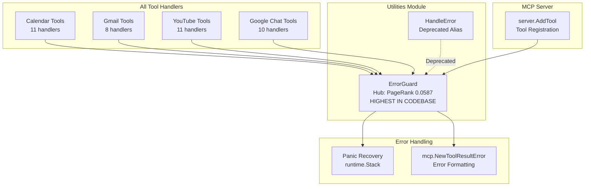
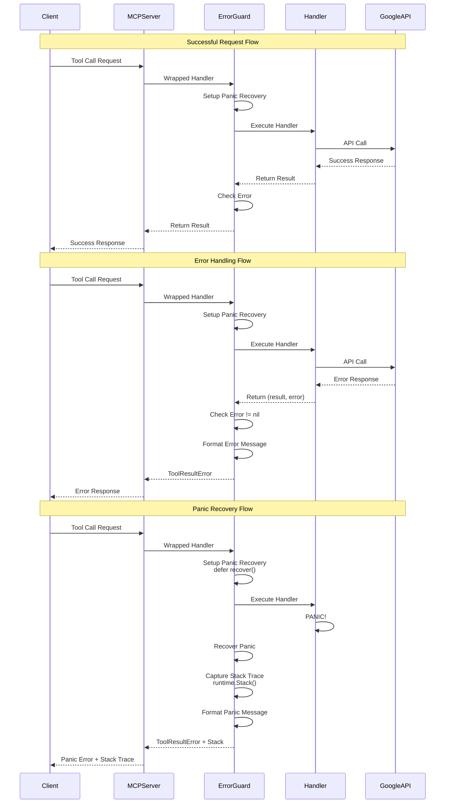

# Utilities Module Documentation

## Overview

The Utilities module provides critical infrastructure for error handling and panic recovery across all tool handlers in the MCP server. With a compact 36 lines of code, it implements the highest-ranked hub component in the codebase (`ErrorGuard` with PageRank 0.0587), serving as the foundation for robust error handling across all Google API integrations.

## Module Metrics

| Metric | Value |
|--------|-------|
| **Lines of Code** | 36 |
| **Key Hub Components** | `ErrorGuard` (PageRank: 0.0587 - HIGHEST) |
| **Usage Frequency** | Used by ALL tool handlers (50+ handlers) |
| **Complexity** | Low (single responsibility) |
| **Criticality** | Critical (error handling foundation) |

## Architecture

### Component Diagram



### Error Flow Diagram



## Core Components

### ErrorGuard (Hub Component)

**File**: `/Users/firegroup/projects/google-mcp/util/handler.go`

**Signature**: `func ErrorGuard(handler server.ToolHandlerFunc) server.ToolHandlerFunc`

**PageRank**: 0.0587 (HIGHEST in codebase - called by every tool handler)

**Description**: Wraps tool handlers with comprehensive error handling and panic recovery, providing a consistent error handling layer for all tool operations.

**Parameters**:
| Parameter | Type | Description |
|-----------|------|----------|
| `handler` | `server.ToolHandlerFunc` | Original tool handler function |

**Returns**: `server.ToolHandlerFunc` - Wrapped handler with error handling

**Implementation**:
```go
func ErrorGuard(handler server.ToolHandlerFunc) server.ToolHandlerFunc {
    return func(arguments map[string]interface{}) (result *mcp.CallToolResult, err error) {
        // Setup panic recovery
        defer func() {
            if r := recover(); r != nil {
                // Get stack trace
                buf := make([]byte, 4096)
                n := runtime.Stack(buf, true)
                stackTrace := string(buf[:n])

                // Create error result with panic details and stack trace
                result = mcp.NewToolResultError(
                    fmt.Sprintf("Panic: %v\nStack trace:\n%s", r, stackTrace)
                )
            }
        }()

        // Execute original handler
        result, err = handler(arguments)

        // Handle returned errors
        if err != nil {
            return mcp.NewToolResultError(fmt.Sprintf("Error: %v", err)), nil
        }

        return result, nil
    }
}
```

### Features

#### 1. Panic Recovery

**Purpose**: Catch and recover from panics in tool handlers, preventing server crashes.

**Mechanism**:
```go
defer func() {
    if r := recover(); r != nil {
        // Panic recovered!
    }
}()
```

**Stack Trace Capture**:
```go
buf := make([]byte, 4096)
n := runtime.Stack(buf, true)
stackTrace := string(buf[:n])
```

**Benefits**:
- Server continues running after handler panic
- Full stack trace provided for debugging
- Consistent error format for panics

**Example Stack Trace Output**:
```
Panic: runtime error: index out of range [5] with length 3
Stack trace:
goroutine 1 [running]:
github.com/nguyenvanduocit/google-mcp/tools.gChatListSpacesHandler(...)
    /path/to/tools/gchat.go:105 +0x123
github.com/nguyenvanduocit/google-mcp/util.ErrorGuard.func1(...)
    /path/to/util/handler.go:23 +0x89
...
```

#### 2. Error Handling

**Purpose**: Convert Go errors to MCP tool result errors.

**Mechanism**:
```go
result, err = handler(arguments)
if err != nil {
    return mcp.NewToolResultError(fmt.Sprintf("Error: %v", err)), nil
}
```

**Benefits**:
- Consistent error formatting
- Errors returned as tool results (not thrown)
- User-friendly error messages

**Example Error Output**:
```
Error: failed to list spaces: googleapi: Error 401: Request had invalid authentication credentials.
```

#### 3. Transparent Pass-Through

**Purpose**: Return successful results unchanged.

**Mechanism**:
```go
result, err = handler(arguments)
if err != nil {
    // Handle error
}
return result, nil // Success case - return as-is
```

**Benefits**:
- No overhead for successful operations
- Original result format preserved
- No additional processing for success case

### Usage Pattern

**Tool Registration**:
```go
func RegisterGChatTool(s *server.MCPServer) {
    // Create tool definition
    listSpacesTool := mcp.NewTool("gchat_list_spaces",
        mcp.WithDescription("List all available Google Chat spaces/rooms"),
    )

    // Register with ErrorGuard wrapper
    s.AddTool(listSpacesTool, util.ErrorGuard(gChatListSpacesHandler))
    //                        ^^^^^^^^^^^^^^^^ Wraps handler
}
```

**Handler Implementation**:
```go
// Handler can return errors or panic - ErrorGuard handles both
func gChatListSpacesHandler(arguments map[string]interface{}) (*mcp.CallToolResult, error) {
    // API call might return error
    spaces, err := services.DefaultGChatService().Spaces.List().Do()
    if err != nil {
        // ErrorGuard will convert this to ToolResultError
        return mcp.NewToolResultError(fmt.Sprintf("failed to list spaces: %v", err)), nil
    }

    // Might panic (e.g., nil pointer dereference)
    // ErrorGuard will catch and format with stack trace
    result := processSpaces(spaces)

    return mcp.NewToolResultText(string(result)), nil
}
```

### HandleError (Deprecated)

**Signature**: `func HandleError(handler server.ToolHandlerFunc) server.ToolHandlerFunc`

**Description**: Deprecated alias for `ErrorGuard`. Maintained for backward compatibility.

**Implementation**:
```go
func HandleError(handler server.ToolHandlerFunc) server.ToolHandlerFunc {
    return ErrorGuard(handler)
}
```

**Usage**: Use `ErrorGuard` instead in new code.

```go
// Old (deprecated)
s.AddTool(tool, util.HandleError(handler))

// New (preferred)
s.AddTool(tool, util.ErrorGuard(handler))
```

## Error Handling Patterns

### Pattern 1: API Error Handling

**Tool handlers return formatted errors**:
```go
func handler(arguments map[string]interface{}) (*mcp.CallToolResult, error) {
    result, err := apiCall()
    if err != nil {
        // Return user-friendly error (ErrorGuard passes through)
        return mcp.NewToolResultError(fmt.Sprintf("failed to do X: %v", err)), nil
    }
    return mcp.NewToolResultText(result), nil
}
```

**ErrorGuard behavior**: Error already formatted, passed through unchanged.

### Pattern 2: Validation Error Handling

**Tool handlers validate input**:
```go
func handler(arguments map[string]interface{}) (*mcp.CallToolResult, error) {
    videoID, _ := arguments["video_id"].(string)
    if videoID == "" {
        // Return validation error
        return mcp.NewToolResultError("video_id is required for 'get' action"), nil
    }
    // Continue processing...
}
```

**ErrorGuard behavior**: Validation error passed through unchanged.

### Pattern 3: Unexpected Error (Go error return)

**Tool handlers return Go errors**:
```go
func handler(arguments map[string]interface{}) (*mcp.CallToolResult, error) {
    result, err := someOperation()
    if err != nil {
        // Return Go error (less common pattern)
        return nil, err
    }
    return mcp.NewToolResultText(result), nil
}
```

**ErrorGuard behavior**: Converts Go error to `ToolResultError`:
```go
if err != nil {
    return mcp.NewToolResultError(fmt.Sprintf("Error: %v", err)), nil
}
```

### Pattern 4: Panic Recovery

**Tool handlers may panic**:
```go
func handler(arguments map[string]interface{}) (*mcp.CallToolResult, error) {
    // Might panic: nil pointer, index out of range, etc.
    result := data[index] // Could panic!
    return mcp.NewToolResultText(result), nil
}
```

**ErrorGuard behavior**: Catches panic and returns formatted error with stack trace:
```
Panic: runtime error: index out of range [5] with length 3
Stack trace:
goroutine 1 [running]:
...
```

## Usage Examples

### Example 1: Basic Tool Handler with ErrorGuard

```go
package tools

import (
    "fmt"
    "github.com/mark3labs/mcp-go/mcp"
    "github.com/mark3labs/mcp-go/server"
    "github.com/nguyenvanduocit/google-mcp/util"
)

func RegisterMyTool(s *server.MCPServer) {
    myTool := mcp.NewTool("my_tool",
        mcp.WithDescription("Example tool"),
        mcp.WithString("param", mcp.Required()),
    )

    // Wrap handler with ErrorGuard
    s.AddTool(myTool, util.ErrorGuard(myToolHandler))
}

func myToolHandler(arguments map[string]interface{}) (*mcp.CallToolResult, error) {
    param := arguments["param"].(string)

    // API call that might fail
    result, err := someAPICall(param)
    if err != nil {
        // ErrorGuard passes this through unchanged
        return mcp.NewToolResultError(fmt.Sprintf("API call failed: %v", err)), nil
    }

    return mcp.NewToolResultText(result), nil
}
```

### Example 2: Multiple Error Handling Strategies

```go
func complexHandler(arguments map[string]interface{}) (*mcp.CallToolResult, error) {
    // 1. Validation error (user-friendly)
    videoID, _ := arguments["video_id"].(string)
    if videoID == "" {
        return mcp.NewToolResultError("video_id is required"), nil
    }

    // 2. API error (formatted with context)
    video, err := fetchVideo(videoID)
    if err != nil {
        return mcp.NewToolResultError(fmt.Sprintf("failed to fetch video %s: %v", videoID, err)), nil
    }

    // 3. Processing that might panic
    // ErrorGuard will catch panics and provide stack trace
    thumbnail := video.Thumbnails[0] // Might panic if empty!

    return mcp.NewToolResultText(thumbnail.URL), nil
}
```

### Example 3: Graceful Degradation with Partial Errors

```go
func batchHandler(arguments map[string]interface{}) (*mcp.CallToolResult, error) {
    items := arguments["items"].([]string)

    results := []string{}
    errors := []string{}

    for _, item := range items {
        // Process each item, collecting errors
        result, err := processItem(item)
        if err != nil {
            errors = append(errors, fmt.Sprintf("%s: %v", item, err))
            continue
        }
        results = append(results, result)
    }

    // Return partial success with error details
    if len(errors) > 0 {
        return mcp.NewToolResultError(fmt.Sprintf(
            "Processed %d/%d items. Errors:\n%s",
            len(results), len(items), strings.Join(errors, "\n"),
        )), nil
    }

    return mcp.NewToolResultText(strings.Join(results, "\n")), nil
}
```

### Example 4: Custom Panic Recovery with Context

```go
func riskyHandler(arguments map[string]interface{}) (*mcp.CallToolResult, error) {
    // Custom panic recovery for specific operations
    defer func() {
        if r := recover(); r != nil {
            log.Printf("Recovered from panic in riskyHandler: %v", r)
            // Let ErrorGuard handle the panic (will re-panic)
            panic(r)
        }
    }()

    // Risky operation
    result := performRiskyOperation(arguments)

    return mcp.NewToolResultText(result), nil
}

// Note: ErrorGuard's panic recovery will still catch and format the panic
```

## Testing Error Handling

### Unit Test Example

```go
package util_test

import (
    "errors"
    "testing"
    "github.com/mark3labs/mcp-go/mcp"
    "github.com/mark3labs/mcp-go/server"
    "github.com/nguyenvanduocit/google-mcp/util"
)

func TestErrorGuard_Success(t *testing.T) {
    handler := func(args map[string]interface{}) (*mcp.CallToolResult, error) {
        return mcp.NewToolResultText("success"), nil
    }

    wrapped := util.ErrorGuard(handler)
    result, err := wrapped(map[string]interface{}{})

    if err != nil {
        t.Errorf("Expected no error, got: %v", err)
    }
    if result.Content[0].Text != "success" {
        t.Errorf("Expected 'success', got: %v", result.Content[0].Text)
    }
}

func TestErrorGuard_Error(t *testing.T) {
    handler := func(args map[string]interface{}) (*mcp.CallToolResult, error) {
        return nil, errors.New("test error")
    }

    wrapped := util.ErrorGuard(handler)
    result, err := wrapped(map[string]interface{}{})

    if err != nil {
        t.Errorf("Expected nil error (converted to ToolResultError), got: %v", err)
    }
    if !result.IsError {
        t.Error("Expected error result")
    }
}

func TestErrorGuard_Panic(t *testing.T) {
    handler := func(args map[string]interface{}) (*mcp.CallToolResult, error) {
        panic("test panic")
    }

    wrapped := util.ErrorGuard(handler)
    result, err := wrapped(map[string]interface{}{})

    if err != nil {
        t.Errorf("Expected nil error (panic converted to ToolResultError), got: %v", err)
    }
    if !result.IsError {
        t.Error("Expected error result")
    }
    if !strings.Contains(result.Content[0].Text, "Panic: test panic") {
        t.Error("Expected panic message in result")
    }
    if !strings.Contains(result.Content[0].Text, "Stack trace:") {
        t.Error("Expected stack trace in result")
    }
}
```

## Performance Considerations

### Overhead

**Panic Recovery**:
- `defer` function: Minimal overhead (~1-2 nanoseconds)
- Stack trace capture: Only on panic (no cost for success)
- Stack buffer: 4KB allocation per handler call

**Error Handling**:
- Error check: Single `if` statement (negligible)
- Error formatting: Only on error path
- String formatting: Minimal allocation

**Success Path**:
- Zero additional allocations
- No error formatting
- Direct pass-through

### Optimization

**Buffer Size**:
```go
buf := make([]byte, 4096) // 4KB buffer for stack trace
```

**Consideration**:
- 4KB sufficient for most stack traces
- Larger stacks truncated (rare)
- Could make configurable if needed

**Alternative (unbounded)**:
```go
// Use debug.Stack() for unbounded capture
stackTrace := string(debug.Stack())
```

## Best Practices

### 1. Always Use ErrorGuard

**DO**:
```go
s.AddTool(myTool, util.ErrorGuard(myHandler))
```

**DON'T**:
```go
s.AddTool(myTool, myHandler) // No error handling!
```

### 2. Return User-Friendly Errors

**DO**:
```go
if err != nil {
    return mcp.NewToolResultError(fmt.Sprintf("failed to list videos: %v", err)), nil
}
```

**DON'T**:
```go
if err != nil {
    return nil, err // Less informative
}
```

### 3. Let ErrorGuard Catch Panics

**DO**:
```go
// No need for custom panic recovery in most cases
func handler(args map[string]interface{}) (*mcp.CallToolResult, error) {
    result := data[index] // ErrorGuard catches panics
    return mcp.NewToolResultText(result), nil
}
```

**DON'T** (unless you have specific cleanup needs):
```go
func handler(args map[string]interface{}) (*mcp.CallToolResult, error) {
    defer func() {
        if r := recover() {
            // Unnecessary - ErrorGuard already handles this
        }
    }()
    // ...
}
```

### 4. Provide Context in Errors

**DO**:
```go
return mcp.NewToolResultError(fmt.Sprintf(
    "failed to update video %s: %v", videoID, err,
)), nil
```

**DON'T**:
```go
return mcp.NewToolResultError(err.Error()), nil
```

### 5. Handle Partial Failures

**DO**:
```go
successCount := 0
for _, item := range items {
    if err := processItem(item); err != nil {
        failedItems = append(failedItems, item)
        continue
    }
    successCount++
}

if len(failedItems) > 0 {
    return mcp.NewToolResultError(fmt.Sprintf(
        "Processed %d/%d items successfully. Failed items: %v",
        successCount, len(items), failedItems,
    )), nil
}
```

## Troubleshooting

### Panics Still Crashing Server

**Symptom**: Server crashes despite ErrorGuard.

**Possible Causes**:
1. Panic outside handler (e.g., in service initialization)
2. Handler not wrapped with ErrorGuard
3. Goroutine panic (ErrorGuard doesn't catch goroutines)

**Solution**:
```go
// Wrap service initialization
defer func() {
    if r := recover(); r != nil {
        log.Fatalf("Service initialization panic: %v", r)
    }
}()

// Ensure all handlers wrapped
s.AddTool(tool, util.ErrorGuard(handler))

// For goroutines, add panic recovery
go func() {
    defer func() {
        if r := recover(); r != nil {
            log.Printf("Goroutine panic: %v", r)
        }
    }()
    // Goroutine work...
}()
```

### Stack Trace Truncated

**Symptom**: Stack trace ends with "..." or appears incomplete.

**Cause**: Stack trace exceeds 4KB buffer.

**Solution**:
```go
// Increase buffer size
buf := make([]byte, 8192) // 8KB instead of 4KB
n := runtime.Stack(buf, true)
```

### Error Messages Not User-Friendly

**Symptom**: Errors too technical for end users.

**Solution**: Wrap errors with context at handler level:
```go
// Before
return mcp.NewToolResultError(err.Error()), nil

// After
return mcp.NewToolResultError(fmt.Sprintf(
    "Unable to list spaces. Please check your permissions. Details: %v", err,
)), nil
```

## Advanced Topics

### Custom Error Types

```go
type ToolError struct {
    Code    string
    Message string
    Details interface{}
}

func (e *ToolError) Error() string {
    return fmt.Sprintf("[%s] %s", e.Code, e.Message)
}

func handler(args map[string]interface{}) (*mcp.CallToolResult, error) {
    // Can return custom error types
    return nil, &ToolError{
        Code:    "INVALID_VIDEO_ID",
        Message: "Video ID must be 11 characters",
        Details: map[string]interface{}{
            "provided": args["video_id"],
        },
    }
}
```

### Structured Error Logging

```go
import "log/slog"

func enhancedErrorGuard(handler server.ToolHandlerFunc) server.ToolHandlerFunc {
    return func(arguments map[string]interface{}) (result *mcp.CallToolResult, err error) {
        defer func() {
            if r := recover(); r != nil {
                slog.Error("Handler panic",
                    "panic", r,
                    "arguments", arguments,
                    "stack", string(debug.Stack()),
                )
                result = mcp.NewToolResultError(fmt.Sprintf("Panic: %v", r))
            }
        }()

        result, err = handler(arguments)

        if err != nil {
            slog.Error("Handler error",
                "error", err,
                "arguments", arguments,
            )
            return mcp.NewToolResultError(fmt.Sprintf("Error: %v", err)), nil
        }

        return result, nil
    }
}
```

## Related Documentation

- **Tool Modules**: calendar.md, gmail.md, gchat.md, youtube.md
- **Services Layer**: services.md (service initialization error handling)
- **MCP Server**: [mcp-go documentation](https://github.com/mark3labs/mcp-go)
- **Go Error Handling**: [Effective Go - Errors](https://go.dev/doc/effective_go#errors)
- **Go Panic Recovery**: [Go Blog - Defer, Panic, and Recover](https://go.dev/blog/defer-panic-and-recover)

## Summary

The `ErrorGuard` utility is the cornerstone of error handling in the MCP server:

- **Highest PageRank (0.0587)**: Most connected component in the codebase
- **Universal Coverage**: Used by every tool handler (50+ handlers)
- **Three-Layer Protection**:
  1. Panic recovery with stack traces
  2. Error conversion to tool results
  3. Transparent success pass-through
- **Minimal Overhead**: Zero cost for successful operations
- **Fail-Safe**: Prevents server crashes from handler panics

**Key Takeaway**: Always wrap tool handlers with `ErrorGuard` to ensure robust, production-ready error handling across all Google API integrations.
