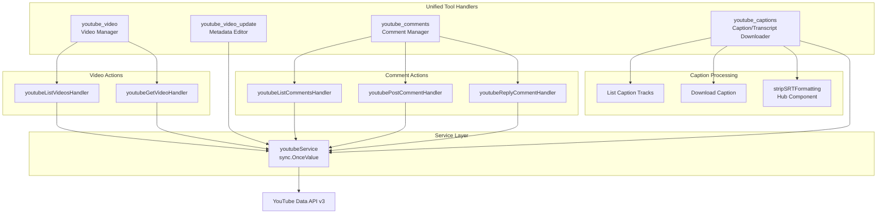
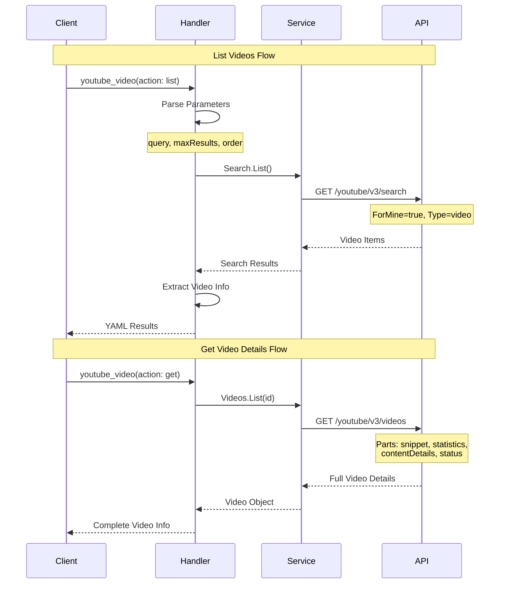
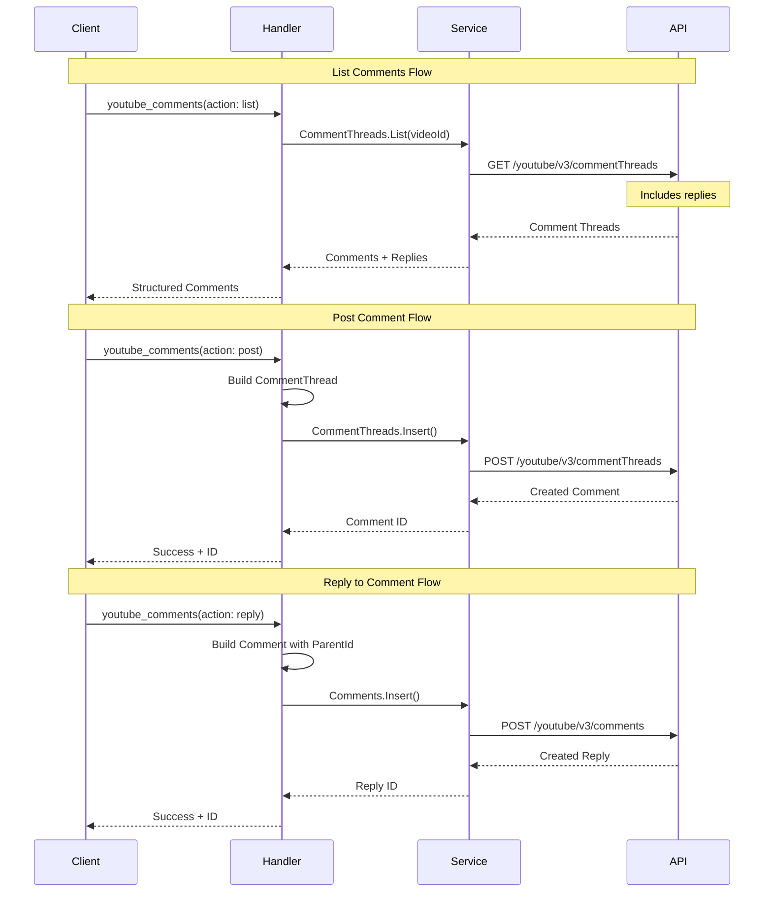
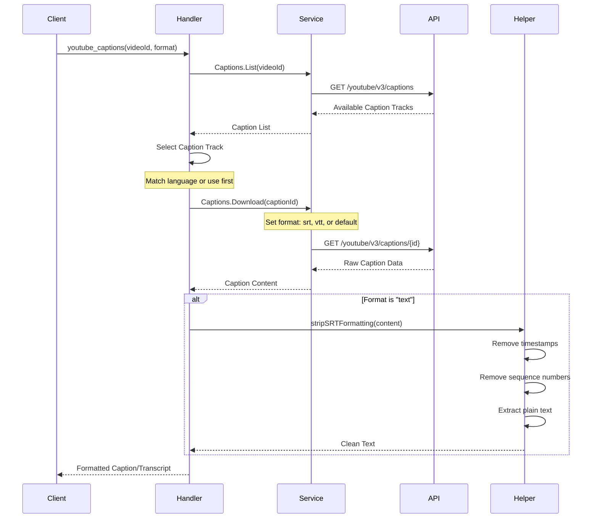

# YouTube Tools Module

## Overview

The YouTube module provides comprehensive video and content management capabilities for the MCP server, enabling video operations, comment management, and caption/transcript handling through YouTube's Data API v3. With 517 lines of code, it implements 4 unified tools that manage videos, comments, captions, and metadata across YouTube channels.

## Module Metrics

| Metric | Value |
|--------|-------|
| **Lines of Code** | 517 |
| **Number of Tools** | 4 (11 sub-actions) |
| **Service Dependency** | `youtube.Service` |
| **Key Hub Components** | `stripSRTFormatting` |
| **Complexity** | Medium (unified action pattern, transcript processing) |

## Architecture

### Component Diagram



### Data Flow Patterns

#### Video Management Flow


#### Comment Management Flow


#### Caption Download Flow


## Tools

### 1. youtube_video

**Description**: Unified tool for listing or getting YouTube videos from the authenticated user's channel.

**Parameters**:
| Parameter | Type | Required | Description |
|-----------|------|----------|-------------|
| `action` | string | Yes | Action to perform: "list", "get" |
| `video_id` | string | Conditional | Video ID (required for "get" action) |
| `query` | string | No | Search query to filter videos (optional for "list" action) |
| `max_results` | number | No | Maximum results to return (default: 10, list action) |
| `order` | string | No | Sort order: date, rating, relevance, title, viewCount (default: date) |

#### Action: list

**Description**: List videos from the authenticated user's channel with optional search filtering.

**Example**:
```json
{
  "action": "list",
  "query": "tutorial",
  "max_results": 20,
  "order": "viewCount"
}
```

**Returns**:
```yaml
count: 3
videos:
  - video_id: "dQw4w9WgXcQ"
    title: "Getting Started Tutorial"
    published_at: "2024-01-15T10:00:00Z"
    description: "Learn the basics in this comprehensive tutorial"
  - video_id: "abc123xyz"
    title: "Advanced Techniques"
    published_at: "2024-01-10T15:30:00Z"
    description: "Take your skills to the next level"
```

**Implementation Details**:
- Uses `Search.List` with `ForMine(true)` to filter to authenticated user's videos
- Type filter set to "video" (excludes playlists, channels)
- Supports search query for content filtering
- Orders by specified field (date, viewCount, etc.)
- Returns basic snippet information

#### Action: get

**Description**: Get detailed information about a specific video including statistics and content details.

**Example**:
```json
{
  "action": "get",
  "video_id": "dQw4w9WgXcQ"
}
```

**Returns**:
```yaml
video_id: "dQw4w9WgXcQ"
title: "Getting Started Tutorial"
description: "Learn the basics..."
channel: "My Channel"
published_at: "2024-01-15T10:00:00Z"
tags:
  - tutorial
  - beginner
  - guide
category_id: "22"
views: 15234
likes: 892
comments: 45
duration: "PT15M33S"
privacy_status: "public"
upload_status: "processed"
```

**Implementation Details**:
- Uses `Videos.List` with multiple parts:
  - `snippet`: Title, description, tags, category
  - `statistics`: Views, likes, comment count
  - `contentDetails`: Duration, definition
  - `status`: Privacy status, upload status
- Returns comprehensive video metadata
- Statistics may be null if disabled by user
- Duration in ISO 8601 format (PT15M33S = 15 minutes 33 seconds)

---

### 2. youtube_video_update

**Description**: Update metadata for a YouTube video including title, description, tags, category, and privacy status.

**Parameters**:
| Parameter | Type | Required | Description |
|-----------|------|----------|-------------|
| `video_id` | string | Yes | Video ID to update |
| `title` | string | No | New video title |
| `description` | string | No | New video description |
| `tags` | string | No | Comma-separated tags |
| `category_id` | string | No | YouTube category ID (e.g., "22" for People & Blogs) |
| `privacy_status` | string | No | Privacy status: "public", "unlisted", "private" |

**Returns**:
```
Successfully updated video dQw4w9WgXcQ
```

**Implementation Details**:
- Fetches only the parts that need updating (efficient API usage)
- Supports partial updates (only specified fields are changed)
- Preserves existing values for unspecified fields
- Uses PATCH-like semantics via `Videos.Update`
- Requires at least one field to update

**Partial Update Logic**:
```go
// Determine which parts to fetch and update
needsSnippet := title != "" || description != "" || tags != "" || categoryID != ""
needsStatus := privacyStatus != ""

fetchParts := []string{}
if needsSnippet {
    fetchParts = append(fetchParts, "snippet")
}
if needsStatus {
    fetchParts = append(fetchParts, "status")
}
```

**Example**:
```json
{
  "video_id": "dQw4w9WgXcQ",
  "title": "Updated Tutorial Title",
  "tags": "tutorial, updated, 2024",
  "privacy_status": "public"
}
```

**Category IDs**:
- `1`: Film & Animation
- `2`: Autos & Vehicles
- `10`: Music
- `15`: Pets & Animals
- `17`: Sports
- `19`: Travel & Events
- `20`: Gaming
- `22`: People & Blogs
- `23`: Comedy
- `24`: Entertainment
- `25`: News & Politics
- `26`: Howto & Style
- `27`: Education
- `28`: Science & Technology

---

### 3. youtube_comments

**Description**: Unified tool for managing YouTube video comments - list, post new comments, or reply to existing comments.

**Parameters**:
| Parameter | Type | Required | Description |
|-----------|------|----------|-------------|
| `action` | string | Yes | Action to perform: "list", "post", "reply" |
| `video_id` | string | Conditional | Video ID (required for list/post actions) |
| `comment_id` | string | Conditional | Comment ID (required for reply action) |
| `text` | string | Conditional | Comment text (required for post/reply actions) |
| `max_results` | number | No | Maximum comments to return (default: 20, list action) |
| `order` | string | No | Sort order: "time", "relevance" (default: time, list action) |

#### Action: list

**Description**: List comment threads for a video, including replies.

**Example**:
```json
{
  "action": "list",
  "video_id": "dQw4w9WgXcQ",
  "max_results": 50,
  "order": "relevance"
}
```

**Returns**:
```yaml
count: 2
comments:
  - comment_id: "UgxKREWJKWL7vGNqCjZ4AaABAg"
    author: "John Doe"
    text: "Great tutorial! Very helpful."
    likes: 15
    published_at: "2024-01-16T08:30:00Z"
    reply_count: 2
    replies:
      - comment_id: "UgxKREWJKWL7vGNqCjZ4AaABAg.9aBC123"
        author: "Channel Owner"
        text: "Thanks for watching!"
        likes: 3
        published_at: "2024-01-16T09:15:00Z"
  - comment_id: "UgxKREWJKWL7vGNqCjZ4AaABAh"
    author: "Jane Smith"
    text: "Could you explain the part about...?"
    likes: 5
    published_at: "2024-01-16T10:00:00Z"
    reply_count: 0
```

**Implementation Details**:
- Uses `CommentThreads.List` to fetch top-level comments with replies
- Includes both snippet and replies parts
- Returns plain text format (`TextFormat("plainText")`)
- Orders by time (newest first) or relevance
- Reply count indicates total replies (may exceed returned replies)
- Returns up to default reply limit per thread (additional replies need separate fetch)

#### Action: post

**Description**: Post a new top-level comment on a video.

**Example**:
```json
{
  "action": "post",
  "video_id": "dQw4w9WgXcQ",
  "text": "Excellent tutorial! Looking forward to more content."
}
```

**Returns**:
```
Comment posted successfully. Comment ID: UgxKREWJKWL7vGNqCjZ4AaABAg
```

**Implementation Details**:
- Creates a new `CommentThread` with top-level comment
- Uses `CommentThreads.Insert` API
- Returns comment ID for future reference
- Comment appears immediately (no moderation delay for channel owner)

#### Action: reply

**Description**: Reply to an existing comment.

**Example**:
```json
{
  "action": "reply",
  "comment_id": "UgxKREWJKWL7vGNqCjZ4AaABAg",
  "text": "Thanks for your feedback! I'll cover that in the next video."
}
```

**Returns**:
```
Reply posted successfully. Comment ID: UgxKREWJKWL7vGNqCjZ4AaABAg.9aBC123
```

**Implementation Details**:
- Creates a new `Comment` with `ParentId` set to original comment
- Uses `Comments.Insert` API (not CommentThreads)
- Reply inherits thread context from parent comment
- Returns unique reply comment ID

---

### 4. youtube_captions

**Description**: Download captions/transcript from a YouTube video in various formats (text, SRT, VTT).

**Parameters**:
| Parameter | Type | Required | Description |
|-----------|------|----------|-------------|
| `video_id` | string | Yes | Video ID to get captions from |
| `language` | string | No | Language code (e.g., "en", "vi"). Default: first available |
| `format` | string | No | Output format: "text" (plain text, default), "srt", "vtt" |

**Returns**:
```yaml
video_id: "dQw4w9WgXcQ"
language: "en"
format: "text"
content: |
  Welcome to this tutorial
  In this video we'll cover the basics
  Let's get started
```

**Format Examples**:

**text** (default - plain text transcript):
```
Welcome to this tutorial
In this video we'll cover the basics
Let's get started with the first topic
```

**srt** (SubRip format with timestamps):
```
1
00:00:00,000 --> 00:00:03,000
Welcome to this tutorial

2
00:00:03,000 --> 00:00:06,000
In this video we'll cover the basics
```

**vtt** (WebVTT format):
```
WEBVTT

00:00:00.000 --> 00:00:03.000
Welcome to this tutorial

00:00:03.000 --> 00:00:06.000
In this video we'll cover the basics
```

**Implementation Details**:

1. **List Available Captions**:
```go
captionResp, err := youtubeService().Captions.List([]string{"id", "snippet"}, videoID).Do()
```

2. **Select Caption Track**:
   - If language specified, find matching track
   - Otherwise, use first available track
   - Returns error if no captions available

3. **Download Caption**:
```go
downloadCall := youtubeService().Captions.Download(captionID)
downloadCall = downloadCall.Tfmt(format) // "srt" or "vtt"
resp, err := downloadCall.Download()
```

4. **Process Format**:
   - For "text" format: Download as SRT, then strip formatting
   - For "srt" or "vtt": Return raw download
   - Uses `stripSRTFormatting` helper for plain text extraction

**Hub Component - stripSRTFormatting**:
```go
func stripSRTFormatting(srt string) string {
    lines := strings.Split(srt, "\n")
    var textLines []string
    for _, line := range lines {
        line = strings.TrimSpace(line)

        // Skip empty lines
        if line == "" {
            continue
        }

        // Skip timestamp lines (contain "-->")
        if strings.Contains(line, "-->") {
            continue
        }

        // Skip sequence numbers (pure digits)
        isNumber := true
        for _, c := range line {
            if c < '0' || c > '9' {
                isNumber = false
                break
            }
        }
        if isNumber {
            continue
        }

        textLines = append(textLines, line)
    }
    return strings.Join(textLines, "\n")
}
```

**Example**:
```json
{
  "video_id": "dQw4w9WgXcQ",
  "language": "en",
  "format": "text"
}
```

**Example (SRT format)**:
```json
{
  "video_id": "dQw4w9WgXcQ",
  "language": "en",
  "format": "srt"
}
```

**Error Cases**:
- No captions available for video
- Specified language not available
- Caption download failed (may require channel ownership)

---

## Service Layer

### youtubeService

**Type**: `sync.OnceValue[*youtube.Service]`

**Description**: Thread-safe singleton for YouTube service initialization.

**Initialization**:
```go
var youtubeService = sync.OnceValue(func() *youtube.Service {
    ctx := context.Background()

    // Get environment variables
    tokenFile := os.Getenv("GOOGLE_TOKEN_FILE")
    if tokenFile == "" {
        panic("GOOGLE_TOKEN_FILE environment variable must be set")
    }

    credentialsFile := os.Getenv("GOOGLE_CREDENTIALS_FILE")
    if credentialsFile == "" {
        panic("GOOGLE_CREDENTIALS_FILE environment variable must be set")
    }

    // Create HTTP client with OAuth credentials
    client := services.GoogleHttpClient(tokenFile, credentialsFile)

    // Initialize YouTube service
    srv, err := youtube.NewService(ctx, option.WithHTTPClient(client))
    if err != nil {
        panic(fmt.Sprintf("failed to create YouTube service: %v", err))
    }

    return srv
})
```

**Features**:
- Lazy initialization on first access
- Thread-safe singleton pattern using `sync.OnceValue`
- Panics on initialization failure for fail-fast behavior
- Reuses Google HTTP client with OAuth credentials

**Environment Variables Required**:
- `GOOGLE_TOKEN_FILE`: Path to OAuth token JSON
- `GOOGLE_CREDENTIALS_FILE`: Path to OAuth credentials JSON

## Error Handling

All tool handlers are wrapped with `util.ErrorGuard` for consistent error handling:

```go
s.AddTool(videoTool, util.ErrorGuard(youtubeVideoHandler))
```

### Error Handling Patterns

1. **API Errors**:
```go
resp, err := youtubeService().Videos.List(parts).Id(videoID).Do()
if err != nil {
    return mcp.NewToolResultError(fmt.Sprintf("failed to get video: %v", err)), nil
}
```

2. **Validation Errors**:
```go
if videoID == "" {
    return mcp.NewToolResultError("video_id is required for 'get' action"), nil
}
```

3. **Not Found Errors**:
```go
if len(resp.Items) == 0 {
    return mcp.NewToolResultError(fmt.Sprintf("video not found: %s", videoID)), nil
}
```

4. **Action Validation**:
```go
switch action {
case "list", "get":
    // Valid actions
default:
    return mcp.NewToolResultError("Invalid action. Must be one of: list, get"), nil
}
```

5. **Update Validation**:
```go
if !needsSnippet && !needsStatus {
    return mcp.NewToolResultError("no fields to update. Provide at least one of: title, description, tags, category_id, privacy_status"), nil
}
```

## Usage Examples

### Example 1: Content Management Workflow

```go
// 1. List recent videos
videos := youtube_video({
    "action": "list",
    "max_results": 10,
    "order": "date",
})

// 2. Get detailed stats for top video
details := youtube_video({
    "action": "get",
    "video_id": videos.videos[0].video_id,
})

// 3. Update metadata
youtube_video_update({
    "video_id": videos.videos[0].video_id,
    "title": "Updated: " + details.title,
    "tags": "updated, 2024, tutorial",
})

// 4. Check comments
comments := youtube_comments({
    "action": "list",
    "video_id": videos.videos[0].video_id,
    "max_results": 20,
})
```

### Example 2: Comment Engagement

```go
// 1. List comments sorted by relevance
comments := youtube_comments({
    "action": "list",
    "video_id": "dQw4w9WgXcQ",
    "order": "relevance",
    "max_results": 50,
})

// 2. Reply to top comments
for (comment of comments.comments.slice(0, 5)) {
    youtube_comments({
        "action": "reply",
        "comment_id": comment.comment_id,
        "text": "Thanks for watching and commenting!",
    })
}

// 3. Post a pinned comment
youtube_comments({
    "action": "post",
    "video_id": "dQw4w9WgXcQ",
    "text": "📌 Check out the resources mentioned in the description!",
})
```

### Example 3: Transcript Analysis

```go
// 1. Download transcript as plain text
transcript := youtube_captions({
    "video_id": "dQw4w9WgXcQ",
    "language": "en",
    "format": "text",
})

// 2. Analyze transcript content
keywords := extractKeywords(transcript.content)

// 3. Update video tags based on transcript
youtube_video_update({
    "video_id": "dQw4w9WgXcQ",
    "tags": keywords.join(", "),
})

// 4. Download SRT for external use
srtCaptions := youtube_captions({
    "video_id": "dQw4w9WgXcQ",
    "format": "srt",
})
```

### Example 4: Batch Video Updates

```go
// 1. Find all videos matching query
videos := youtube_video({
    "action": "list",
    "query": "old tutorial",
    "max_results": 50,
})

// 2. Update metadata for each
for (video of videos.videos) {
    youtube_video_update({
        "video_id": video.video_id,
        "description": video.description + "\n\n[Updated 2024]",
        "tags": video.tags + ", updated, 2024",
    })
}
```

## Performance Considerations

### API Quotas

YouTube Data API v3 has daily quota limits:
- Each operation costs quota units
- Default quota: 10,000 units per day
- Monitor usage in Google Cloud Console

**Quota Costs**:
| Operation | Cost |
|-----------|------|
| `search.list` | 100 units |
| `videos.list` | 1 unit |
| `videos.update` | 50 units |
| `commentThreads.list` | 1 unit |
| `commentThreads.insert` | 50 units |
| `comments.insert` | 50 units |
| `captions.list` | 50 units |
| `captions.download` | 200 units |

**Optimization Strategies**:

1. **Fetch Only Needed Parts**:
```go
// Efficient: Only fetch snippet
Videos.List([]string{"snippet"})

// Inefficient: Fetch all parts
Videos.List([]string{"snippet", "statistics", "contentDetails", "status"})
```

2. **Batch Processing**:
```go
// Get multiple videos in one call
Videos.List([]string{"snippet"}).Id("id1,id2,id3")
```

3. **Cache Results**:
```go
// Cache video details to avoid repeated fetches
cachedVideos := map[string]VideoInfo{}
```

### Caching

**Service Singleton**:
```go
var youtubeService = sync.OnceValue[*youtube.Service](...)
```
- Service initialized once per application lifecycle
- Thread-safe access across concurrent requests
- Reduces OAuth overhead

### Concurrency

**Safe for Concurrent Use**:
- All tool handlers are stateless
- Service singleton uses `sync.OnceValue` for thread-safe initialization
- No shared mutable state

## Integration Notes

### OAuth Scopes Required

The YouTube tools require the following scopes (defined in `services/google.go`):

```go
youtube.YoutubeScope,              // Full access
youtube.YoutubeForceSslScope,      // Force SSL
youtube.YoutubeUploadScope,        // Upload videos
youtube.YoutubepartnerChannelAuditScope, // Channel audit
youtube.YoutubepartnerScope,       // Content management
youtube.YoutubeReadonlyScope,      // Read-only access
```

**Minimum Required Scopes**:
- `youtube.YoutubeScope`: For full read/write access
- Or combination of specific scopes:
  - `youtube.YoutubeReadonlyScope`: For listing/getting
  - `youtube.YoutubeForceSslScope`: For updates
  - `youtube.YoutubeUploadScope`: For video management

### Channel Ownership

Most operations require channel ownership:
- `ForMine(true)`: Filters to authenticated user's videos
- Comment posting: Posts as authenticated user
- Caption access: May require video ownership
- Video updates: Requires ownership of video

### Content Restrictions

**Comment Management**:
- Comments may be disabled on video
- Moderation settings affect visibility
- Spam filters may hide comments

**Caption Access**:
- Captions must exist on video
- Auto-generated captions supported
- May require specific permissions

## Best Practices

### 1. Video Identification

Always use YouTube video IDs (11 characters):
```go
// Correct
"video_id": "dQw4w9WgXcQ"

// Incorrect (full URLs not accepted)
"video_id": "https://youtube.com/watch?v=dQw4w9WgXcQ"
```

### 2. Efficient Updates

Update only what changed:
```go
// Good: Only update title
youtube_video_update({
    "video_id": "abc123",
    "title": "New Title",
})

// Wasteful: Fetching and updating all fields
youtube_video_update({
    "video_id": "abc123",
    "title": details.title,
    "description": details.description,
    "tags": details.tags,
    "category_id": details.category_id,
    "privacy_status": details.privacy_status,
})
```

### 3. Comment Pagination

For videos with many comments:
```go
// Start with reasonable limit
comments := youtube_comments({
    "action": "list",
    "video_id": "abc123",
    "max_results": 50,
})

// Note: YouTube API handles pagination automatically within max_results
// No manual page token needed for comment threads
```

### 4. Transcript Format Selection

Choose the right format:
```go
// For analysis/AI processing: use "text"
transcript := youtube_captions({
    "video_id": "abc123",
    "format": "text",
})

// For subtitling software: use "srt" or "vtt"
captions := youtube_captions({
    "video_id": "abc123",
    "format": "srt",
})
```

### 5. Error Recovery

Handle common failure cases:
```go
// Check for captions before downloading
captionResp := youtube_captions({
    "video_id": "abc123",
    "language": "en",
})

if (captionResp.error) {
    console.log("No captions available, skipping transcript analysis")
} else {
    analyzeTranscript(captionResp.content)
}
```

## Troubleshooting

### Common Issues

**1. "Video not found"**
- Video ID may be incorrect (check 11-character format)
- Video may be private or deleted
- Authenticated user may not have access

**2. "Failed to list videos"**
- OAuth token may be expired
- Channel may not have any videos
- API quota may be exceeded

**3. "Failed to update video"**
- User may not own the video
- Invalid category ID
- Privacy status change may be restricted

**4. "No captions available"**
- Video may not have captions
- Auto-generated captions may be disabled
- Language code may be incorrect

**5. "Comment posting failed"**
- Comments may be disabled on video
- User may be rate-limited
- Content may violate policies

### Debug Tips

**Check video ownership**:
```go
// Verify video is in your channel
videos := youtube_video({
    "action": "list",
    "query": "specific title",
})
```

**Inspect caption tracks**:
```go
// List available languages
captions := youtube_captions({
    "video_id": "abc123",
})
// Error message will show available languages
```

**Verify API quota**:
- Check Google Cloud Console → APIs & Services → Dashboard
- Monitor quota usage and limits
- Request quota increase if needed

## Related Modules

- **services/google.go**: Shared Google HTTP client and scope management
- **util/handler.go**: Error handling wrapper (`ErrorGuard`)

## API Reference

- [YouTube Data API v3 Documentation](https://developers.google.com/youtube/v3)
- [Videos API Reference](https://developers.google.com/youtube/v3/docs/videos)
- [CommentThreads API Reference](https://developers.google.com/youtube/v3/docs/commentThreads)
- [Comments API Reference](https://developers.google.com/youtube/v3/docs/comments)
- [Captions API Reference](https://developers.google.com/youtube/v3/docs/captions)
- [API Quota Calculator](https://developers.google.com/youtube/v3/determine_quota_cost)
